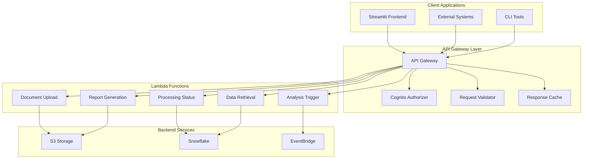

# API Specifications

## Overview

The Agentic Compliance-Mapping System exposes a comprehensive REST API through AWS API Gateway, providing endpoints for document processing, compliance analysis, and report generation. This document details all API endpoints, request/response schemas, authentication mechanisms, and integration patterns.

## API Architecture



## Base Configuration

### API Gateway Settings
- **Base URL**: `https://api.compliance-mapping.com/v1`
- **Protocol**: HTTPS only
- **Authentication**: AWS Cognito JWT tokens
- **Rate Limiting**: 1000 requests/minute per user
- **Request Timeout**: 30 seconds
- **Max Request Size**: 50MB (for document uploads)

### Common Headers
```http
Authorization: Bearer <jwt_token>
Content-Type: application/json
X-API-Version: 1.0
X-Request-ID: <uuid>
```

### Standard Response Format
```json
{
  "success": true,
  "data": {},
  "message": "Operation completed successfully",
  "request_id": "uuid",
  "timestamp": "2025-07-26T10:30:00Z",
  "errors": []
}
```

## Authentication Endpoints

### POST /auth/login
Authenticate user and obtain JWT token.

**Request:**
```json
{
  "username": "user@company.com",
  "password": "secure_password",
  "client_id": "cognito_client_id"
}
```

**Response:**
```json
{
  "success": true,
  "data": {
    "access_token": "jwt_access_token",
    "refresh_token": "jwt_refresh_token",
    "expires_in": 3600,
    "token_type": "Bearer",
    "user_info": {
      "user_id": "uuid",
      "email": "user@company.com",
      "role": "analyst",
      "permissions": ["upload", "analyze", "report"]
    }
  }
}
```

### POST /auth/refresh
Refresh expired JWT token.

**Request:**
```json
{
  "refresh_token": "jwt_refresh_token"
}
```

**Response:**
```json
{
  "success": true,
  "data": {
    "access_token": "new_jwt_access_token",
    "expires_in": 3600
  }
}
```

## Document Management Endpoints

### POST /documents/upload
Upload document for processing.

**Request (Multipart Form Data):**
```
file: <binary_file_data>
document_type: "vendor_contract" | "regulation" | "terms_conditions"
metadata: {
  "title": "Contract with Vendor XYZ",
  "jurisdiction": "wa",
  "effective_date": "2025-01-01",
  "tags": ["mining", "safety", "environmental"]
}
```

**Response:**
```json
{
  "success": true,
  "data": {
    "document_id": "uuid",
    "file_name": "contract_vendor_xyz.pdf",
    "file_size": 2048576,
    "document_type": "vendor_contract",
    "upload_timestamp": "2025-07-26T10:30:00Z",
    "processing_status": "uploaded",
    "estimated_processing_time": 300
  }
}
```

### GET /documents/{document_id}
Retrieve document information and processing status.

**Response:**
```json
{
  "success": true,
  "data": {
    "document_id": "uuid",
    "file_name": "contract_vendor_xyz.pdf",
    "document_type": "vendor_contract",
    "processing_status": "completed",
    "upload_timestamp": "2025-07-26T10:30:00Z",
    "processed_at": "2025-07-26T10:35:00Z",
    "metadata": {
      "total_pages": 25,
      "total_clauses": 45,
      "extraction_confidence": 0.95,
      "language": "en",
      "jurisdiction": "wa"
    },
    "processing_summary": {
      "clauses_extracted": 45,
      "entities_identified": 128,
      "regulations_mapped": 23,
      "compliance_score": 0.78
    }
  }
}
```

### GET /documents
List documents with filtering and pagination.

**Query Parameters:**
- `page`: Page number (default: 1)
- `limit`: Items per page (default: 20, max: 100)
- `document_type`: Filter by document type
- `status`: Filter by processing status
- `jurisdiction`: Filter by jurisdiction
- `date_from`: Filter by upload date (ISO 8601)
- `date_to`: Filter by upload date (ISO 8601)

**Response:**
```json
{
  "success": true,
  "data": {
    "documents": [
      {
        "document_id": "uuid",
        "file_name": "contract_vendor_xyz.pdf",
        "document_type": "vendor_contract",
        "processing_status": "completed",
        "upload_timestamp": "2025-07-26T10:30:00Z",
        "compliance_score": 0.78
      }
    ],
    "pagination": {
      "current_page": 1,
      "total_pages": 5,
      "total_items": 95,
      "items_per_page": 20
    }
  }
}
```

### DELETE /documents/{document_id}
Delete document and associated data.

**Response:**
```json
{
  "success": true,
  "data": {
    "document_id": "uuid",
    "deleted_at": "2025-07-26T10:30:00Z",
    "cleanup_status": "completed"
  }
}
```

## Processing Endpoints

### POST /processing/analyze/{document_id}
Trigger compliance analysis for a document.

**Request:**
```json
{
  "analysis_type": "full_compliance", // "full_compliance", "safety_focus", "environmental_focus"
  "priority": "normal", // "low", "normal", "high"
  "custom_parameters": {
    "focus_areas": ["safety", "environmental"],
    "jurisdiction_filter": ["wa", "federal"],
    "include_recommendations": true
  }
}
```

**Response:**
```json
{
  "success": true,
  "data": {
    "analysis_id": "uuid",
    "document_id": "uuid",
    "analysis_type": "full_compliance",
    "status": "queued",
    "estimated_completion": "2025-07-26T10:45:00Z",
    "queue_position": 3
  }
}
```

### GET /processing/status/{analysis_id}
Get analysis processing status.

**Response:**
```json
{
  "success": true,
  "data": {
    "analysis_id": "uuid",
    "document_id": "uuid",
    "status": "processing", // "queued", "processing", "completed", "failed"
    "progress_percentage": 65,
    "current_stage": "semantic_mapping",
    "stages_completed": ["document_ingestion", "clause_extraction"],
    "estimated_completion": "2025-07-26T10:45:00Z",
    "processing_logs": [
      {
        "timestamp": "2025-07-26T10:35:00Z",
        "stage": "clause_extraction",
        "message": "Extracted 45 clauses",
        "level": "info"
      }
    ]
  }
}
```

### POST /processing/batch-analyze
Trigger batch analysis for multiple documents.

**Request:**
```json
{
  "document_ids": ["uuid1", "uuid2", "uuid3"],
  "analysis_type": "full_compliance",
  "priority": "normal",
  "batch_name": "Q3 Contract Review",
  "notification_webhook": "https://client.com/webhook/analysis-complete"
}
```

**Response:**
```json
{
  "success": true,
  "data": {
    "batch_id": "uuid",
    "batch_name": "Q3 Contract Review",
    "document_count": 3,
    "analysis_ids": ["uuid1", "uuid2", "uuid3"],
    "estimated_completion": "2025-07-26T11:30:00Z",
    "status": "queued"
  }
}
```

## Analysis Results Endpoints

### GET /analysis/{analysis_id}/results
Retrieve analysis results.

**Response:**
```json
{
  "success": true,
  "data": {
    "analysis_id": "uuid",
    "document_id": "uuid",
    "analysis_type": "full_compliance",
    "overall_compliance_score": 0.78,
    "risk_level": "medium",
    "analysis_timestamp": "2025-07-26T10:45:00Z",
    "processing_time_seconds": 245,
    "compliance_breakdown": {
      "safety_compliance": 0.75,
      "environmental_compliance": 0.85,
      "operational_compliance": 0.80,
      "commercial_terms": 0.90
    },
    "key_findings": [
      {
        "category": "safety_compliance",
        "finding": "Missing safety management system requirements",
        "severity": "high",
        "clause_reference": "Section 8.1",
        "regulation_reference": "WHS Act 2011 Section 19",
        "recommendation": "Include specific SMS documentation requirements"
      }
    ],
    "risk_assessment": {
      "critical_risks": 0,
      "high_risks": 3,
      "medium_risks": 8,
      "low_risks": 15,
      "total_risks": 26
    },
    "agent_analyses": {
      "safety_agent": {
        "score": 0.75,
        "gaps_identified": 3,
        "recommendations": 5
      },
      "environmental_agent": {
        "score": 0.85,
        "gaps_identified": 2,
        "recommendations": 3
      }
    }
  }
}
```

### GET /analysis/{analysis_id}/compliance-mappings
Retrieve detailed compliance mappings.

**Query Parameters:**
- `category`: Filter by compliance category
- `status`: Filter by compliance status
- `risk_level`: Filter by risk level
- `page`: Page number
- `limit`: Items per page

**Response:**
```json
{
  "success": true,
  "data": {
    "mappings": [
      {
        "mapping_id": "uuid",
        "clause_id": "uuid",
        "clause_text": "Contractor shall maintain safety management system...",
        "clause_reference": "Section 8.1",
        "regulation_id": "WHS_ACT_2011_S19",
        "regulation_text": "Person conducting business must ensure...",
        "compliance_status": "non_compliant",
        "compliance_score": 0.65,
        "similarity_score": 0.87,
        "risk_level": "high",
        "gap_analysis": {
          "missing_elements": ["specific documentation requirements"],
          "additional_elements": ["insurance requirements"],
          "coverage_percentage": 0.75
        },
        "recommendations": [
          "Add clause requiring documented SMS",
          "Specify annual review requirements"
        ]
      }
    ],
    "pagination": {
      "current_page": 1,
      "total_pages": 3,
      "total_items": 45
    },
    "summary": {
      "total_mappings": 45,
      "compliant": 32,
      "non_compliant": 8,
      "partially_compliant": 5
    }
  }
}
```

## Reporting Endpoints

### POST /reports/generate
Generate compliance report.

**Request:**
```json
{
  "analysis_id": "uuid",
  "report_type": "detailed_audit", // "executive_summary", "detailed_audit", "checklist", "gap_analysis"
  "format": "pdf", // "pdf", "html", "json", "excel"
  "custom_parameters": {
    "include_recommendations": true,
    "include_clause_text": true,
    "group_by_category": true,
    "show_risk_matrix": true,
    "company_branding": {
      "logo_url": "https://preciousmetalinfo.com/wp-content/uploads/2019/04/Untitled-1-13.jpg",
      "company_name": "Mining Corp Ltd"
    }
  }
}
```

**Response:**
```json
{
  "success": true,
  "data": {
    "report_id": "uuid",
    "analysis_id": "uuid",
    "report_type": "detailed_audit",
    "format": "pdf",
    "status": "generating",
    "estimated_completion": "2025-07-26T10:50:00Z"
  }
}
```

### GET /reports/{report_id}/status
Check report generation status.

**Response:**
```json
{
  "success": true,
  "data": {
    "report_id": "uuid",
    "status": "completed", // "generating", "completed", "failed"
    "progress_percentage": 100,
    "file_size_bytes": 2048576,
    "generated_at": "2025-07-26T10:50:00Z",
    "download_url": "https://api.compliance-mapping.com/v1/reports/uuid/download",
    "expires_at": "2025-07-27T10:50:00Z"
  }
}
```

### GET /reports/{report_id}/download
Download generated report.

**Response:**
- **Content-Type**: `application/pdf` | `application/json` | `application/vnd.openxmlformats-officedocument.spreadsheetml.sheet`
- **Content-Disposition**: `attachment; filename="compliance_report.pdf"`
- **Body**: Binary file content

### GET /reports
List generated reports.

**Query Parameters:**
- `analysis_id`: Filter by analysis ID
- `report_type`: Filter by report type
- `format`: Filter by format
- `date_from`: Filter by generation date
- `date_to`: Filter by generation date

**Response:**
```json
{
  "success": true,
  "data": {
    "reports": [
      {
        "report_id": "uuid",
        "analysis_id": "uuid",
        "report_type": "detailed_audit",
        "format": "pdf",
        "file_size_bytes": 2048576,
        "generated_at": "2025-07-26T10:50:00Z",
        "download_count": 3,
        "expires_at": "2025-07-27T10:50:00Z"
      }
    ],
    "pagination": {
      "current_page": 1,
      "total_pages": 2,
      "total_items": 25
    }
  }
}
```

## Reference Data Endpoints

### GET /regulations
Retrieve regulation catalog.

**Query Parameters:**
- `jurisdiction`: Filter by jurisdiction
- `category`: Filter by category
- `search`: Text search in regulation content
- `page`: Page number
- `limit`: Items per page

**Response:**
```json
{
  "success": true,
  "data": {
    "regulations": [
      {
        "regulation_id": "WHS_ACT_2011_S19",
        "act_name": "Work Health and Safety Act 2011",
        "jurisdiction": "federal",
        "category": "safety",
        "section_number": "19",
        "regulation_title": "Primary duty of care",
        "regulation_text": "A person conducting a business...",
        "effective_date": "2012-01-01",
        "status": "active"
      }
    ],
    "pagination": {
      "current_page": 1,
      "total_pages": 15,
      "total_items": 287
    }
  }
}
```

### GET /clause-types
Retrieve clause type definitions.

**Response:**
```json
{
  "success": true,
  "data": {
    "clause_types": [
      {
        "clause_type_id": "safety_management",
        "type_name": "Safety Management System",
        "type_category": "safety_compliance",
        "description": "Clauses related to safety management systems",
        "typical_keywords": ["safety management", "SMS", "safety procedures"],
        "regulatory_significance": "critical"
      }
    ]
  }
}
```

## Webhook Endpoints

### POST /webhooks/register
Register webhook for event notifications.

**Request:**
```json
{
  "webhook_url": "https://client.com/webhook/compliance-events",
  "events": ["analysis_completed", "report_generated", "processing_failed"],
  "secret": "webhook_secret_key",
  "active": true
}
```

**Response:**
```json
{
  "success": true,
  "data": {
    "webhook_id": "uuid",
    "webhook_url": "https://client.com/webhook/compliance-events",
    "events": ["analysis_completed", "report_generated", "processing_failed"],
    "created_at": "2025-07-26T10:30:00Z",
    "status": "active"
  }
}
```

## Error Handling

### Error Response Format
```json
{
  "success": false,
  "error": {
    "code": "VALIDATION_ERROR",
    "message": "Invalid document format",
    "details": {
      "field": "file",
      "reason": "Only PDF files are supported"
    }
  },
  "request_id": "uuid",
  "timestamp": "2025-07-26T10:30:00Z"
}
```

### Error Codes
- `AUTHENTICATION_ERROR`: Invalid or expired token
- `AUTHORIZATION_ERROR`: Insufficient permissions
- `VALIDATION_ERROR`: Invalid request parameters
- `RESOURCE_NOT_FOUND`: Requested resource doesn't exist
- `PROCESSING_ERROR`: Error during document processing
- `RATE_LIMIT_EXCEEDED`: Too many requests
- `INTERNAL_ERROR`: Server-side error

## Rate Limiting

### Rate Limit Headers
```http
X-RateLimit-Limit: 1000
X-RateLimit-Remaining: 995
X-RateLimit-Reset: 1627296000
X-RateLimit-Window: 60
```

### Rate Limit Response (429)
```json
{
  "success": false,
  "error": {
    "code": "RATE_LIMIT_EXCEEDED",
    "message": "Rate limit exceeded. Try again in 60 seconds.",
    "retry_after": 60
  }
}
```

## Streamlit Integration

### Frontend API Client Configuration
```python
import requests
import streamlit as st

class ComplianceAPIClient:
    def __init__(self, base_url, token):
        self.base_url = base_url
        self.headers = {
            'Authorization': f'Bearer {token}',
            'Content-Type': 'application/json',
            'X-API-Version': '1.0'
        }
    
    def upload_document(self, file, document_type, metadata=None):
        files = {'file': file}
        data = {
            'document_type': document_type,
            'metadata': json.dumps(metadata or {})
        }
        response = requests.post(
            f'{self.base_url}/documents/upload',
            files=files,
            data=data,
            headers={'Authorization': self.headers['Authorization']}
        )
        return response.json()
    
    def get_analysis_results(self, analysis_id):
        response = requests.get(
            f'{self.base_url}/analysis/{analysis_id}/results',
            headers=self.headers
        )
        return response.json()
    
    def generate_report(self, analysis_id, report_type, format='pdf'):
        data = {
            'analysis_id': analysis_id,
            'report_type': report_type,
            'format': format
        }
        response = requests.post(
            f'{self.base_url}/reports/generate',
            json=data,
            headers=self.headers
        )
        return response.json()
```

This comprehensive API specification provides all necessary endpoints and integration patterns for the Agentic Compliance-Mapping System, ensuring seamless interaction between frontend applications and backend services.
