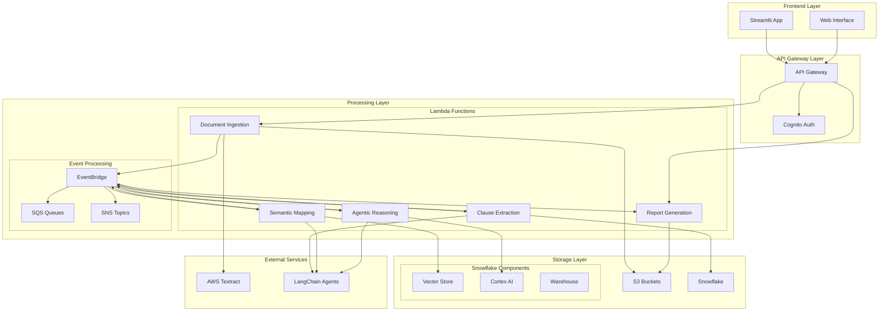
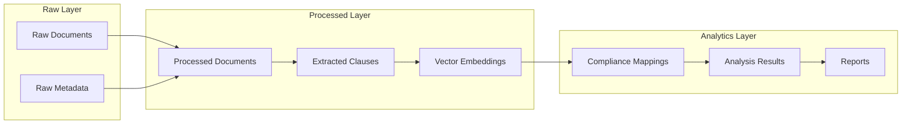
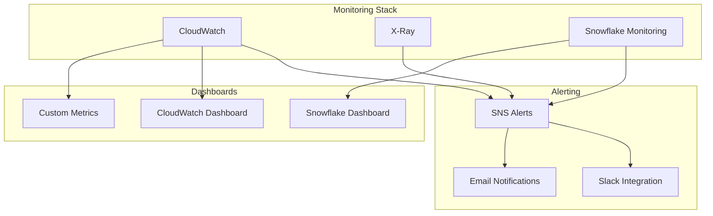

# System Architecture

## Overview

The Agentic Compliance-Mapping System is built on a serverless, event-driven architecture leveraging AWS services and Snowflake's advanced AI capabilities. The system is designed for high scalability, cost-effectiveness, and real-time processing capabilities.

## High-Level Architecture



## AWS Services Integration

### Core Services

#### AWS Lambda
- **Function Architecture**: Python 3.9 runtime with custom layers
- **Memory Configuration**: 1024MB - 3008MB based on processing requirements
- **Timeout Settings**: 15 minutes for document processing, 5 minutes for API responses
- **Concurrency**: Reserved concurrency for critical functions

**Lambda Functions:**
1. **document-ingestion-lambda**: PDF processing and text extraction
2. **clause-extraction-lambda**: AI-powered clause identification
3. **semantic-mapping-lambda**: Vector similarity computation
4. **agentic-reasoning-lambda**: Multi-agent compliance analysis
5. **report-generation-lambda**: Audit report compilation

#### API Gateway
- **Type**: REST API with regional endpoint
- **Authentication**: AWS Cognito integration
- **Rate Limiting**: 1000 requests per minute per user
- **CORS**: Enabled for Streamlit frontend
- **Request Validation**: JSON schema validation for all endpoints

#### Amazon S3
**Bucket Structure:**
- `compliance-docs-raw/`: Original PDF uploads
- `compliance-docs-processed/`: Extracted text and metadata
- `compliance-reports/`: Generated audit reports
- `compliance-models/`: Cached model artifacts
- `compliance-logs/`: Application logs and audit trails

**Security Configuration:**
- Server-side encryption (SSE-S3)
- Versioning enabled
- Lifecycle policies for cost optimization
- Cross-region replication for disaster recovery

#### Amazon EventBridge
- **Custom Event Bus**: `compliance-processing-bus`
- **Event Patterns**: Document processing state changes
- **Dead Letter Queues**: Failed event handling
- **Event Replay**: Capability for reprocessing

#### Amazon SQS
- **Standard Queues**: Batch processing coordination
- **FIFO Queues**: Order-sensitive processing steps
- **Visibility Timeout**: 15 minutes for long-running processes
- **Message Retention**: 14 days

### Supporting Services

#### AWS Textract
- **Document Analysis**: Text and table extraction from PDFs
- **Form Data Extraction**: Key-value pair identification
- **Asynchronous Processing**: For large documents
- **Custom Queries**: Targeted information extraction

#### Amazon Cognito
- **User Pools**: Authentication and user management
- **Identity Pools**: Federated access to AWS resources
- **MFA**: Multi-factor authentication support
- **Custom Attributes**: Role-based access control

#### AWS CloudWatch
- **Metrics**: Custom application metrics
- **Logs**: Centralized logging with retention policies
- **Alarms**: Automated alerting for system issues
- **Dashboards**: Real-time monitoring

## Snowflake Integration Architecture

### Snowflake Components

#### Vector Store Configuration
```sql
-- Vector Store Schema
CREATE SCHEMA IF NOT EXISTS COMPLIANCE_VECTORS;

-- Vector Tables
CREATE TABLE COMPLIANCE_VECTORS.DOCUMENT_EMBEDDINGS (
    document_id VARCHAR(255),
    chunk_id VARCHAR(255),
    embedding VECTOR(FLOAT, 1536),
    metadata VARIANT,
    created_at TIMESTAMP_NTZ DEFAULT CURRENT_TIMESTAMP()
);

-- Vector Search Functions
CREATE OR REPLACE FUNCTION COMPLIANCE_VECTORS.COSINE_SIMILARITY(
    vec1 VECTOR(FLOAT, 1536),
    vec2 VECTOR(FLOAT, 1536)
)
RETURNS FLOAT
LANGUAGE SQL
AS 'VECTOR_COSINE_SIMILARITY(vec1, vec2)';
```

#### Cortex AI Integration
- **Embedding Models**: `snowflake-arctic-embed-m` for document embeddings
- **LLM Models**: `mixtral-8x7b` for reasoning and analysis
- **Custom Functions**: Compliance-specific prompt templates
- **Model Management**: Version control and A/B testing

#### Data Warehouse Structure


## Security Architecture

### Data Protection
- **Encryption at Rest**: AES-256 encryption for all stored data
- **Encryption in Transit**: TLS 1.2+ for all communications
- **Key Management**: AWS KMS with customer-managed keys
- **Data Classification**: Sensitive data tagging and handling

### Access Control
- **IAM Roles**: Principle of least privilege
- **Resource-Based Policies**: Fine-grained access control
- **API Authentication**: JWT tokens with short expiration
- **Audit Logging**: Comprehensive access logging

### Network Security
- **VPC Configuration**: Private subnets for Lambda functions
- **Security Groups**: Restrictive inbound/outbound rules
- **WAF Integration**: Web application firewall protection
- **DDoS Protection**: AWS Shield Standard

## Scalability and Performance

### Auto-Scaling Configuration
- **Lambda Concurrency**: Auto-scaling based on demand
- **API Gateway**: Built-in scaling capabilities
- **Snowflake**: Auto-suspend and auto-resume
- **S3**: Unlimited storage capacity

### Performance Optimization
- **Caching Strategy**: Multi-level caching (API Gateway, Lambda, Snowflake)
- **Connection Pooling**: Efficient database connections
- **Batch Processing**: Optimized for large document sets
- **Parallel Processing**: Concurrent Lambda executions

### Monitoring and Alerting


## Disaster Recovery and Business Continuity

### Backup Strategy
- **S3 Cross-Region Replication**: Automatic backup to secondary region
- **Snowflake Time Travel**: Point-in-time recovery capabilities
- **Lambda Function Versioning**: Code rollback capabilities
- **Configuration Backup**: Infrastructure as Code with Terraform

### Recovery Procedures
- **RTO (Recovery Time Objective)**: 4 hours
- **RPO (Recovery Point Objective)**: 1 hour
- **Automated Failover**: Multi-region deployment capability
- **Data Integrity Checks**: Automated validation procedures

## Cost Optimization

### Resource Management
- **Lambda Provisioned Concurrency**: Only for critical functions
- **S3 Intelligent Tiering**: Automatic cost optimization
- **Snowflake Auto-Suspend**: Automatic warehouse suspension
- **Reserved Capacity**: For predictable workloads

### Cost Monitoring
- **AWS Cost Explorer**: Detailed cost analysis
- **Budget Alerts**: Automated cost threshold notifications
- **Resource Tagging**: Granular cost allocation
- **Usage Analytics**: Optimization recommendations

This architecture provides a robust, scalable, and secure foundation for the Agentic Compliance-Mapping System, ensuring high availability and performance while maintaining cost-effectiveness.
