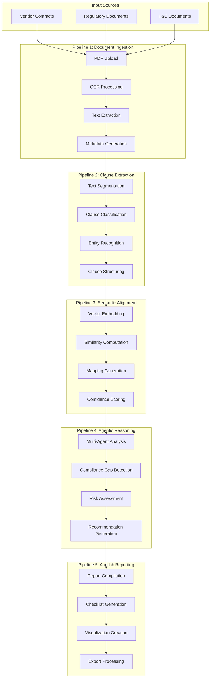
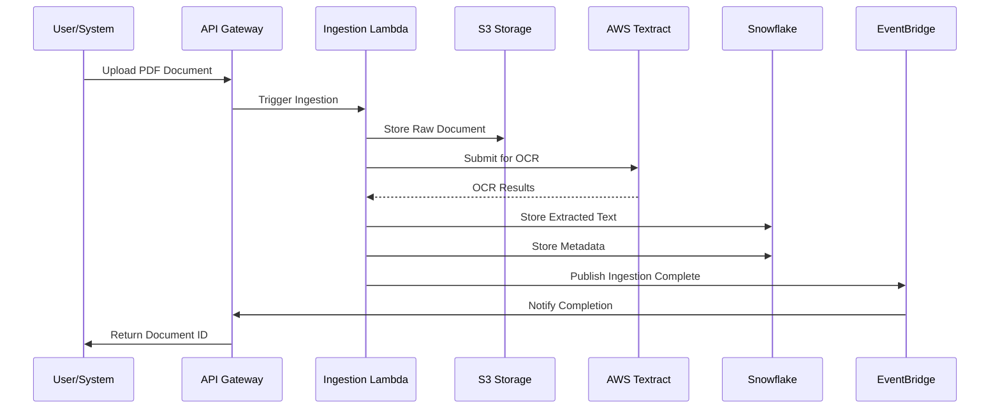
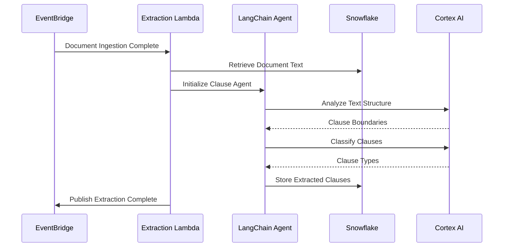
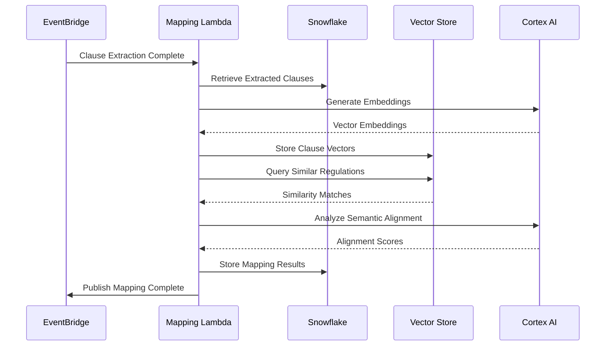
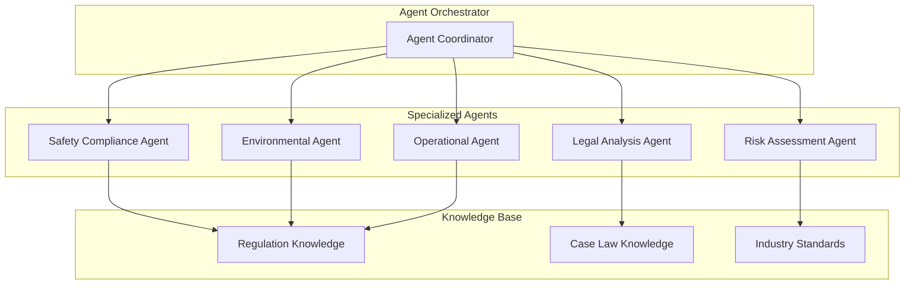
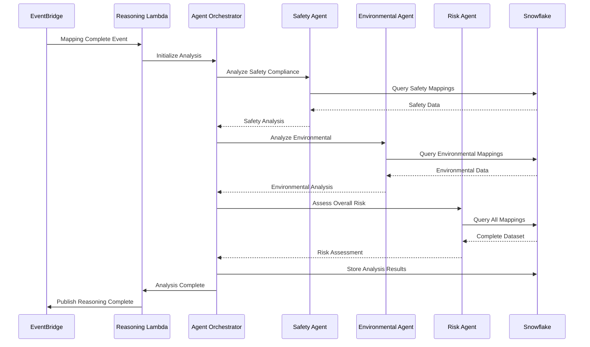
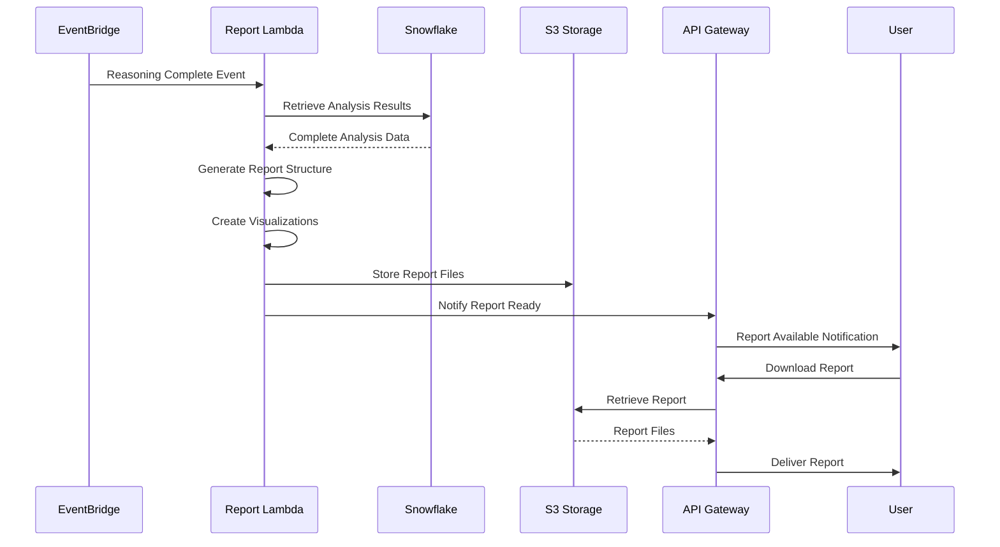

# Data Flow Architecture

## Overview

The Agentic Compliance-Mapping System processes documents through five core pipelines, each designed for specific aspects of compliance analysis. This document details the data flow, processing stages, and inter-pipeline communication patterns.

## Core Pipeline Architecture



## Pipeline 1: Document Ingestion

### Process Flow



### Data Transformations

#### Input Data Structure
```json
{
  "document_id": "uuid",
  "file_name": "contract_vendor_xyz.pdf",
  "file_size": 2048576,
  "upload_timestamp": "2025-07-26T10:30:00Z",
  "document_type": "vendor_contract",
  "source": "streamlit_upload"
}
```

#### Processing Steps
1. **File Validation**: Format, size, and content type verification
2. **OCR Processing**: Text extraction using AWS Textract
3. **Image Processing**: Diagram and chart analysis
4. **Metadata Extraction**: Document properties and structure analysis
5. **Quality Assessment**: Text extraction confidence scoring

#### Output Data Structure
```json
{
  "document_id": "uuid",
  "extracted_text": "full document text",
  "pages": [
    {
      "page_number": 1,
      "text": "page text content",
      "images": ["image_urls"],
      "tables": [{"table_data": "structured"}]
    }
  ],
  "metadata": {
    "total_pages": 25,
    "extraction_confidence": 0.95,
    "language": "en",
    "document_structure": "contract"
  },
  "processing_status": "completed"
}
```

## Pipeline 2: Clause Extraction

### Process Flow



### Clause Classification Schema

#### Australian Mining Regulation Categories
```python
CLAUSE_CATEGORIES = {
    "safety_compliance": {
        "subcategories": [
            "safety_management_system",
            "contractor_safety_plans",
            "hazard_management",
            "emergency_procedures",
            "competency_requirements"
        ]
    },
    "environmental_compliance": {
        "subcategories": [
            "environmental_impact_assessment",
            "water_management",
            "rehabilitation_obligations",
            "waste_management",
            "cultural_heritage"
        ]
    },
    "operational_compliance": {
        "subcategories": [
            "tenement_conditions",
            "reporting_obligations",
            "audit_access",
            "documentation_requirements",
            "change_management"
        ]
    },
    "commercial_terms": {
        "subcategories": [
            "payment_terms",
            "delivery_conditions",
            "warranties",
            "indemnities",
            "termination_clauses"
        ]
    }
}
```

#### Extracted Clause Structure
```json
{
  "clause_id": "uuid",
  "document_id": "parent_document_uuid",
  "clause_text": "full clause content",
  "clause_type": "safety_compliance",
  "clause_subtype": "safety_management_system",
  "section_reference": "Section 8.1",
  "page_numbers": [12, 13],
  "entities": [
    {
      "entity_type": "regulation_reference",
      "entity_value": "WHS Act 2011",
      "confidence": 0.92
    }
  ],
  "compliance_indicators": {
    "mandatory_language": true,
    "specific_requirements": ["SMS documentation", "annual review"],
    "penalties_mentioned": false
  }
}
```

## Pipeline 3: Semantic Alignment & Mapping

### Process Flow



### Vector Embedding Strategy

#### Embedding Model Configuration
```python
EMBEDDING_CONFIG = {
    "model": "snowflake-arctic-embed-m",
    "dimensions": 1536,
    "chunk_size": 512,
    "chunk_overlap": 50,
    "similarity_threshold": 0.75
}
```

#### Semantic Mapping Algorithm
```python
def semantic_alignment_process(clause_text, regulation_corpus):
    # 1. Generate clause embedding
    clause_embedding = generate_embedding(clause_text)
    
    # 2. Search similar regulations
    similar_regs = vector_search(clause_embedding, regulation_corpus)
    
    # 3. Calculate alignment scores
    alignment_scores = []
    for reg in similar_regs:
        score = calculate_semantic_similarity(clause_embedding, reg.embedding)
        alignment_scores.append({
            "regulation_id": reg.id,
            "similarity_score": score,
            "regulation_text": reg.text,
            "compliance_category": reg.category
        })
    
    # 4. Generate mapping confidence
    mapping_confidence = calculate_mapping_confidence(alignment_scores)
    
    return {
        "clause_id": clause_text.id,
        "mappings": alignment_scores,
        "overall_confidence": mapping_confidence
    }
```

### Mapping Output Structure
```json
{
  "mapping_id": "uuid",
  "clause_id": "source_clause_uuid",
  "regulation_mappings": [
    {
      "regulation_id": "WHS_ACT_2011_S19",
      "regulation_text": "Person conducting business must ensure...",
      "similarity_score": 0.87,
      "compliance_category": "safety_compliance",
      "mapping_type": "direct_requirement",
      "gap_analysis": {
        "coverage_percentage": 0.75,
        "missing_elements": ["specific documentation requirements"],
        "additional_elements": ["insurance requirements"]
      }
    }
  ],
  "overall_compliance_score": 0.82,
  "confidence_level": "high"
}
```

## Pipeline 4: Agentic Reasoning Loop

### Multi-Agent Architecture



### Agent Reasoning Process



### Agent Specifications

#### Safety Compliance Agent
```python
class SafetyComplianceAgent:
    def __init__(self):
        self.knowledge_base = load_safety_regulations()
        self.risk_matrix = load_safety_risk_matrix()
    
    def analyze_compliance(self, clause_mappings):
        analysis = {
            "compliance_gaps": [],
            "risk_level": "low",
            "recommendations": [],
            "mandatory_requirements": []
        }
        
        for mapping in clause_mappings:
            if mapping.category == "safety_compliance":
                gap_analysis = self.assess_gap(mapping)
                analysis["compliance_gaps"].append(gap_analysis)
        
        analysis["risk_level"] = self.calculate_risk_level(analysis["compliance_gaps"])
        analysis["recommendations"] = self.generate_recommendations(analysis)
        
        return analysis
```

#### Environmental Compliance Agent
```python
class EnvironmentalAgent:
    def __init__(self):
        self.epbc_requirements = load_epbc_requirements()
        self.state_requirements = load_state_environmental_reqs()
    
    def analyze_environmental_compliance(self, clause_mappings):
        return {
            "federal_compliance": self.check_epbc_compliance(clause_mappings),
            "state_compliance": self.check_state_compliance(clause_mappings),
            "environmental_risks": self.assess_environmental_risks(clause_mappings),
            "mitigation_strategies": self.recommend_mitigations(clause_mappings)
        }
```

### Reasoning Output Structure
```json
{
  "analysis_id": "uuid",
  "document_id": "source_document_uuid",
  "analysis_timestamp": "2025-07-26T15:45:00Z",
  "agent_analyses": {
    "safety_compliance": {
      "overall_score": 0.78,
      "critical_gaps": [
        {
          "gap_type": "missing_safety_management_system",
          "severity": "high",
          "regulation_reference": "WHS Act 2011 Section 19",
          "recommendation": "Include specific SMS requirements"
        }
      ],
      "risk_level": "medium"
    },
    "environmental_compliance": {
      "overall_score": 0.85,
      "federal_compliance": 0.90,
      "state_compliance": 0.80,
      "environmental_risks": ["water_management", "rehabilitation"]
    }
  },
  "consolidated_risk_assessment": {
    "overall_risk_score": 0.72,
    "risk_category": "medium",
    "priority_actions": [
      "Address safety management system requirements",
      "Clarify environmental rehabilitation obligations"
    ]
  }
}
```

## Pipeline 5: Audit & Reporting

### Report Generation Process



### Report Structure

#### Executive Summary Report
```json
{
  "report_id": "uuid",
  "document_id": "source_document_uuid",
  "report_type": "executive_summary",
  "generation_timestamp": "2025-07-26T16:00:00Z",
  "overall_compliance_score": 0.78,
  "risk_level": "medium",
  "key_findings": [
    {
      "category": "safety_compliance",
      "finding": "Missing safety management system requirements",
      "impact": "high",
      "recommendation": "Include specific SMS documentation requirements"
    }
  ],
  "compliance_breakdown": {
    "safety_compliance": 0.75,
    "environmental_compliance": 0.85,
    "operational_compliance": 0.80,
    "commercial_terms": 0.90
  }
}
```

#### Detailed Audit Checklist
```json
{
  "checklist_id": "uuid",
  "document_id": "source_document_uuid",
  "checklist_items": [
    {
      "item_id": "safety_001",
      "category": "safety_compliance",
      "requirement": "Safety Management System Documentation",
      "regulation_reference": "WHS Act 2011 Section 19",
      "status": "non_compliant",
      "clause_reference": "Section 8.1",
      "gap_description": "Contract lacks specific SMS documentation requirements",
      "recommendation": "Add clause requiring contractor to maintain documented SMS",
      "priority": "high",
      "estimated_effort": "medium"
    }
  ],
  "summary_statistics": {
    "total_items": 45,
    "compliant": 32,
    "non_compliant": 8,
    "partially_compliant": 5,
    "compliance_percentage": 0.78
  }
}
```

## Data Storage Schema

### Snowflake Table Structure

```sql
-- Document tracking
CREATE TABLE documents (
    document_id VARCHAR(255) PRIMARY KEY,
    file_name VARCHAR(500),
    document_type VARCHAR(100),
    upload_timestamp TIMESTAMP_NTZ,
    processing_status VARCHAR(50),
    metadata VARIANT
);

-- Extracted clauses
CREATE TABLE clauses (
    clause_id VARCHAR(255) PRIMARY KEY,
    document_id VARCHAR(255),
    clause_text TEXT,
    clause_type VARCHAR(100),
    section_reference VARCHAR(100),
    page_numbers ARRAY,
    entities VARIANT,
    FOREIGN KEY (document_id) REFERENCES documents(document_id)
);

-- Vector embeddings
CREATE TABLE clause_embeddings (
    embedding_id VARCHAR(255) PRIMARY KEY,
    clause_id VARCHAR(255),
    embedding VECTOR(FLOAT, 1536),
    model_version VARCHAR(50),
    created_timestamp TIMESTAMP_NTZ,
    FOREIGN KEY (clause_id) REFERENCES clauses(clause_id)
);

-- Compliance mappings
CREATE TABLE compliance_mappings (
    mapping_id VARCHAR(255) PRIMARY KEY,
    clause_id VARCHAR(255),
    regulation_id VARCHAR(255),
    similarity_score FLOAT,
    compliance_category VARCHAR(100),
    gap_analysis VARIANT,
    FOREIGN KEY (clause_id) REFERENCES clauses(clause_id)
);

-- Analysis results
CREATE TABLE analysis_results (
    analysis_id VARCHAR(255) PRIMARY KEY,
    document_id VARCHAR(255),
    agent_analyses VARIANT,
    overall_risk_score FLOAT,
    analysis_timestamp TIMESTAMP_NTZ,
    FOREIGN KEY (document_id) REFERENCES documents(document_id)
);
```

## Performance Optimization

### Caching Strategy
- **Lambda Layer Caching**: Model artifacts and common libraries
- **Snowflake Result Caching**: Query result caching for repeated analyses
- **S3 Transfer Acceleration**: Faster file uploads
- **API Gateway Caching**: Response caching for static content

### Parallel Processing
- **Concurrent Lambda Execution**: Multiple documents processed simultaneously
- **Batch Processing**: Efficient handling of large document sets
- **Asynchronous Processing**: Non-blocking pipeline execution
- **Event-Driven Architecture**: Efficient resource utilization

This data flow architecture ensures efficient, scalable, and reliable processing of compliance documents while maintaining high accuracy and comprehensive analysis capabilities.
