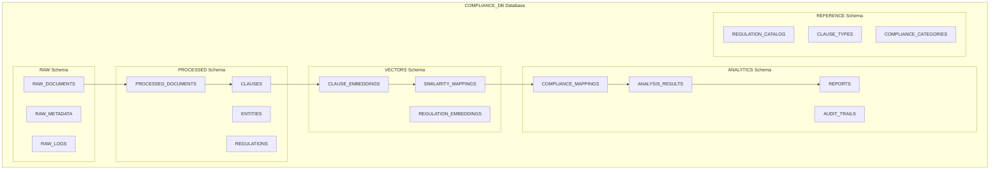

# Database Schema and Vector Store Design

## Overview

The Agentic Compliance-Mapping System utilizes Snowflake as the primary data warehouse with integrated vector store capabilities. This document details the complete database schema, vector store configuration, and data management strategies optimized for Australian mining compliance analysis.

## Snowflake Architecture

### Database Structure



## Core Schema Definitions

### RAW Schema - Document Ingestion Layer

#### RAW_DOCUMENTS Table
```sql
CREATE TABLE RAW.RAW_DOCUMENTS (
    document_id VARCHAR(255) PRIMARY KEY,
    file_name VARCHAR(500) NOT NULL,
    file_path VARCHAR(1000) NOT NULL,
    file_size_bytes NUMBER(15,0),
    file_hash VARCHAR(64),
    content_type VARCHAR(100),
    upload_timestamp TIMESTAMP_NTZ DEFAULT CURRENT_TIMESTAMP(),
    upload_source VARCHAR(100), -- 'streamlit', 'batch_upload', 'api'
    document_type VARCHAR(100), -- 'vendor_contract', 'regulation', 'terms_conditions'
    processing_status VARCHAR(50) DEFAULT 'uploaded', -- 'uploaded', 'processing', 'completed', 'failed'
    raw_content TEXT,
    ocr_confidence FLOAT,
    metadata VARIANT,
    created_by VARCHAR(255),
    created_at TIMESTAMP_NTZ DEFAULT CURRENT_TIMESTAMP(),
    updated_at TIMESTAMP_NTZ DEFAULT CURRENT_TIMESTAMP()
);

-- Indexes for performance
CREATE INDEX idx_raw_documents_status ON RAW.RAW_DOCUMENTS(processing_status);
CREATE INDEX idx_raw_documents_type ON RAW.RAW_DOCUMENTS(document_type);
CREATE INDEX idx_raw_documents_upload_date ON RAW.RAW_DOCUMENTS(upload_timestamp);
```

#### RAW_METADATA Table
```sql
CREATE TABLE RAW.RAW_METADATA (
    metadata_id VARCHAR(255) PRIMARY KEY,
    document_id VARCHAR(255) NOT NULL,
    page_number NUMBER(5,0),
    page_text TEXT,
    page_images ARRAY,
    tables VARIANT,
    extraction_confidence FLOAT,
    processing_errors VARIANT,
    created_at TIMESTAMP_NTZ DEFAULT CURRENT_TIMESTAMP(),
    FOREIGN KEY (document_id) REFERENCES RAW.RAW_DOCUMENTS(document_id)
);

CREATE INDEX idx_raw_metadata_doc_id ON RAW.RAW_METADATA(document_id);
```

### PROCESSED Schema - Structured Data Layer

#### PROCESSED_DOCUMENTS Table
```sql
CREATE TABLE PROCESSED.PROCESSED_DOCUMENTS (
    processed_doc_id VARCHAR(255) PRIMARY KEY,
    document_id VARCHAR(255) NOT NULL,
    title VARCHAR(1000),
    document_category VARCHAR(100),
    document_subcategory VARCHAR(100),
    total_pages NUMBER(5,0),
    total_clauses NUMBER(8,0),
    language VARCHAR(10) DEFAULT 'en',
    jurisdiction VARCHAR(100), -- 'federal', 'nsw', 'qld', 'wa', 'sa', 'vic', 'tas', 'nt', 'act'
    effective_date DATE,
    expiry_date DATE,
    version VARCHAR(50),
    document_structure VARIANT,
    key_entities VARIANT,
    processing_summary VARIANT,
    quality_score FLOAT,
    processed_at TIMESTAMP_NTZ DEFAULT CURRENT_TIMESTAMP(),
    FOREIGN KEY (document_id) REFERENCES RAW.RAW_DOCUMENTS(document_id)
);

CREATE INDEX idx_processed_docs_category ON PROCESSED.PROCESSED_DOCUMENTS(document_category);
CREATE INDEX idx_processed_docs_jurisdiction ON PROCESSED.PROCESSED_DOCUMENTS(jurisdiction);
```

#### CLAUSES Table
```sql
CREATE TABLE PROCESSED.CLAUSES (
    clause_id VARCHAR(255) PRIMARY KEY,
    document_id VARCHAR(255) NOT NULL,
    processed_doc_id VARCHAR(255) NOT NULL,
    clause_number VARCHAR(100),
    section_reference VARCHAR(200),
    clause_title VARCHAR(500),
    clause_text TEXT NOT NULL,
    clause_type VARCHAR(100), -- 'safety', 'environmental', 'operational', 'commercial', 'legal'
    clause_subtype VARCHAR(100),
    page_numbers ARRAY,
    word_count NUMBER(8,0),
    sentence_count NUMBER(6,0),
    complexity_score FLOAT,
    mandatory_language BOOLEAN DEFAULT FALSE,
    penalty_clause BOOLEAN DEFAULT FALSE,
    parent_clause_id VARCHAR(255),
    child_clauses ARRAY,
    extracted_at TIMESTAMP_NTZ DEFAULT CURRENT_TIMESTAMP(),
    FOREIGN KEY (document_id) REFERENCES RAW.RAW_DOCUMENTS(document_id),
    FOREIGN KEY (processed_doc_id) REFERENCES PROCESSED.PROCESSED_DOCUMENTS(processed_doc_id)
);

CREATE INDEX idx_clauses_doc_id ON PROCESSED.CLAUSES(document_id);
CREATE INDEX idx_clauses_type ON PROCESSED.CLAUSES(clause_type);
CREATE INDEX idx_clauses_subtype ON PROCESSED.CLAUSES(clause_subtype);
```

#### ENTITIES Table
```sql
CREATE TABLE PROCESSED.ENTITIES (
    entity_id VARCHAR(255) PRIMARY KEY,
    clause_id VARCHAR(255) NOT NULL,
    entity_type VARCHAR(100), -- 'regulation_reference', 'standard', 'organization', 'location', 'date', 'monetary'
    entity_value VARCHAR(1000) NOT NULL,
    entity_context TEXT,
    confidence_score FLOAT,
    start_position NUMBER(8,0),
    end_position NUMBER(8,0),
    normalized_value VARCHAR(1000),
    entity_metadata VARIANT,
    extracted_at TIMESTAMP_NTZ DEFAULT CURRENT_TIMESTAMP(),
    FOREIGN KEY (clause_id) REFERENCES PROCESSED.CLAUSES(clause_id)
);

CREATE INDEX idx_entities_clause_id ON PROCESSED.ENTITIES(clause_id);
CREATE INDEX idx_entities_type ON PROCESSED.ENTITIES(entity_type);
```

### VECTORS Schema - Vector Store Layer

#### CLAUSE_EMBEDDINGS Table
```sql
CREATE TABLE VECTORS.CLAUSE_EMBEDDINGS (
    embedding_id VARCHAR(255) PRIMARY KEY,
    clause_id VARCHAR(255) NOT NULL,
    embedding VECTOR(FLOAT, 1536) NOT NULL,
    embedding_model VARCHAR(100) DEFAULT 'snowflake-arctic-embed-m',
    model_version VARCHAR(50),
    chunk_index NUMBER(6,0) DEFAULT 0,
    chunk_text TEXT,
    chunk_overlap NUMBER(4,0),
    embedding_metadata VARIANT,
    created_at TIMESTAMP_NTZ DEFAULT CURRENT_TIMESTAMP(),
    FOREIGN KEY (clause_id) REFERENCES PROCESSED.CLAUSES(clause_id)
);

-- Vector search optimization
CREATE INDEX idx_clause_embeddings_clause_id ON VECTORS.CLAUSE_EMBEDDINGS(clause_id);
```

#### REGULATION_EMBEDDINGS Table
```sql
CREATE TABLE VECTORS.REGULATION_EMBEDDINGS (
    reg_embedding_id VARCHAR(255) PRIMARY KEY,
    regulation_id VARCHAR(255) NOT NULL,
    regulation_section VARCHAR(200),
    embedding VECTOR(FLOAT, 1536) NOT NULL,
    embedding_model VARCHAR(100) DEFAULT 'snowflake-arctic-embed-m',
    model_version VARCHAR(50),
    regulation_text TEXT NOT NULL,
    regulation_category VARCHAR(100),
    jurisdiction VARCHAR(100),
    act_name VARCHAR(500),
    section_number VARCHAR(100),
    subsection_number VARCHAR(100),
    effective_date DATE,
    created_at TIMESTAMP_NTZ DEFAULT CURRENT_TIMESTAMP()
);

CREATE INDEX idx_reg_embeddings_category ON VECTORS.REGULATION_EMBEDDINGS(regulation_category);
CREATE INDEX idx_reg_embeddings_jurisdiction ON VECTORS.REGULATION_EMBEDDINGS(jurisdiction);
```

#### SIMILARITY_MAPPINGS Table
```sql
CREATE TABLE VECTORS.SIMILARITY_MAPPINGS (
    mapping_id VARCHAR(255) PRIMARY KEY,
    clause_embedding_id VARCHAR(255) NOT NULL,
    regulation_embedding_id VARCHAR(255) NOT NULL,
    similarity_score FLOAT NOT NULL,
    similarity_method VARCHAR(50) DEFAULT 'cosine',
    mapping_confidence VARCHAR(20), -- 'high', 'medium', 'low'
    semantic_distance FLOAT,
    contextual_relevance FLOAT,
    computed_at TIMESTAMP_NTZ DEFAULT CURRENT_TIMESTAMP(),
    FOREIGN KEY (clause_embedding_id) REFERENCES VECTORS.CLAUSE_EMBEDDINGS(embedding_id),
    FOREIGN KEY (regulation_embedding_id) REFERENCES VECTORS.REGULATION_EMBEDDINGS(reg_embedding_id)
);

CREATE INDEX idx_similarity_mappings_score ON VECTORS.SIMILARITY_MAPPINGS(similarity_score DESC);
CREATE INDEX idx_similarity_mappings_confidence ON VECTORS.SIMILARITY_MAPPINGS(mapping_confidence);
```

### ANALYTICS Schema - Analysis and Reporting Layer

#### COMPLIANCE_MAPPINGS Table
```sql
CREATE TABLE ANALYTICS.COMPLIANCE_MAPPINGS (
    compliance_mapping_id VARCHAR(255) PRIMARY KEY,
    clause_id VARCHAR(255) NOT NULL,
    regulation_id VARCHAR(255) NOT NULL,
    mapping_type VARCHAR(100), -- 'direct_requirement', 'related_obligation', 'supporting_clause'
    compliance_status VARCHAR(50), -- 'compliant', 'non_compliant', 'partially_compliant', 'unclear'
    compliance_score FLOAT,
    gap_analysis VARIANT,
    risk_level VARCHAR(20), -- 'critical', 'high', 'medium', 'low'
    impact_assessment VARIANT,
    remediation_suggestions VARIANT,
    reviewer_notes TEXT,
    auto_generated BOOLEAN DEFAULT TRUE,
    human_verified BOOLEAN DEFAULT FALSE,
    verified_by VARCHAR(255),
    verified_at TIMESTAMP_NTZ,
    created_at TIMESTAMP_NTZ DEFAULT CURRENT_TIMESTAMP(),
    updated_at TIMESTAMP_NTZ DEFAULT CURRENT_TIMESTAMP(),
    FOREIGN KEY (clause_id) REFERENCES PROCESSED.CLAUSES(clause_id)
);

CREATE INDEX idx_compliance_mappings_status ON ANALYTICS.COMPLIANCE_MAPPINGS(compliance_status);
CREATE INDEX idx_compliance_mappings_risk ON ANALYTICS.COMPLIANCE_MAPPINGS(risk_level);
```

#### ANALYSIS_RESULTS Table
```sql
CREATE TABLE ANALYTICS.ANALYSIS_RESULTS (
    analysis_id VARCHAR(255) PRIMARY KEY,
    document_id VARCHAR(255) NOT NULL,
    analysis_type VARCHAR(100), -- 'full_compliance', 'safety_focus', 'environmental_focus'
    overall_compliance_score FLOAT,
    risk_assessment VARIANT,
    agent_analyses VARIANT,
    key_findings VARIANT,
    recommendations VARIANT,
    priority_actions VARIANT,
    compliance_breakdown VARIANT,
    analysis_metadata VARIANT,
    processing_time_seconds NUMBER(8,2),
    model_versions VARIANT,
    analyst_id VARCHAR(255),
    analysis_timestamp TIMESTAMP_NTZ DEFAULT CURRENT_TIMESTAMP(),
    FOREIGN KEY (document_id) REFERENCES RAW.RAW_DOCUMENTS(document_id)
);

CREATE INDEX idx_analysis_results_doc_id ON ANALYTICS.ANALYSIS_RESULTS(document_id);
CREATE INDEX idx_analysis_results_score ON ANALYTICS.ANALYSIS_RESULTS(overall_compliance_score);
```

#### REPORTS Table
```sql
CREATE TABLE ANALYTICS.REPORTS (
    report_id VARCHAR(255) PRIMARY KEY,
    analysis_id VARCHAR(255) NOT NULL,
    report_type VARCHAR(100), -- 'executive_summary', 'detailed_audit', 'checklist', 'gap_analysis'
    report_format VARCHAR(50), -- 'pdf', 'html', 'json', 'excel'
    report_content VARIANT,
    file_path VARCHAR(1000),
    file_size_bytes NUMBER(15,0),
    generation_time_seconds NUMBER(8,2),
    template_version VARCHAR(50),
    custom_parameters VARIANT,
    generated_by VARCHAR(255),
    generated_at TIMESTAMP_NTZ DEFAULT CURRENT_TIMESTAMP(),
    downloaded_count NUMBER(8,0) DEFAULT 0,
    last_downloaded_at TIMESTAMP_NTZ,
    FOREIGN KEY (analysis_id) REFERENCES ANALYTICS.ANALYSIS_RESULTS(analysis_id)
);

CREATE INDEX idx_reports_analysis_id ON ANALYTICS.REPORTS(analysis_id);
CREATE INDEX idx_reports_type ON ANALYTICS.REPORTS(report_type);
```

### REFERENCE Schema - Master Data Layer

#### REGULATION_CATALOG Table
```sql
CREATE TABLE REFERENCE.REGULATION_CATALOG (
    regulation_id VARCHAR(255) PRIMARY KEY,
    act_name VARCHAR(500) NOT NULL,
    act_abbreviation VARCHAR(100),
    jurisdiction VARCHAR(100) NOT NULL,
    regulation_type VARCHAR(100), -- 'act', 'regulation', 'code', 'standard'
    section_number VARCHAR(100),
    subsection_number VARCHAR(100),
    regulation_title VARCHAR(1000),
    regulation_text TEXT NOT NULL,
    parent_regulation_id VARCHAR(255),
    effective_date DATE,
    amendment_date DATE,
    status VARCHAR(50) DEFAULT 'active', -- 'active', 'superseded', 'repealed'
    authority VARCHAR(200),
    category VARCHAR(100), -- 'safety', 'environmental', 'operational', 'administrative'
    subcategory VARCHAR(100),
    keywords ARRAY,
    related_regulations ARRAY,
    citation_format VARCHAR(500),
    url VARCHAR(1000),
    created_at TIMESTAMP_NTZ DEFAULT CURRENT_TIMESTAMP(),
    updated_at TIMESTAMP_NTZ DEFAULT CURRENT_TIMESTAMP()
);

CREATE INDEX idx_regulation_catalog_jurisdiction ON REFERENCE.REGULATION_CATALOG(jurisdiction);
CREATE INDEX idx_regulation_catalog_category ON REFERENCE.REGULATION_CATALOG(category);
CREATE INDEX idx_regulation_catalog_status ON REFERENCE.REGULATION_CATALOG(status);
```

#### CLAUSE_TYPES Table
```sql
CREATE TABLE REFERENCE.CLAUSE_TYPES (
    clause_type_id VARCHAR(255) PRIMARY KEY,
    type_name VARCHAR(100) NOT NULL,
    type_category VARCHAR(100),
    description TEXT,
    typical_keywords ARRAY,
    regulatory_significance VARCHAR(20), -- 'critical', 'important', 'standard', 'informational'
    common_patterns VARIANT,
    validation_rules VARIANT,
    created_at TIMESTAMP_NTZ DEFAULT CURRENT_TIMESTAMP()
);
```

#### COMPLIANCE_CATEGORIES Table
```sql
CREATE TABLE REFERENCE.COMPLIANCE_CATEGORIES (
    category_id VARCHAR(255) PRIMARY KEY,
    category_name VARCHAR(100) NOT NULL,
    parent_category_id VARCHAR(255),
    category_level NUMBER(2,0),
    description TEXT,
    regulatory_framework VARCHAR(200),
    typical_requirements VARIANT,
    risk_factors VARIANT,
    assessment_criteria VARIANT,
    created_at TIMESTAMP_NTZ DEFAULT CURRENT_TIMESTAMP(),
    FOREIGN KEY (parent_category_id) REFERENCES REFERENCE.COMPLIANCE_CATEGORIES(category_id)
);
```

## Vector Store Configuration

### Embedding Functions

```sql
-- Custom embedding function for clause analysis
CREATE OR REPLACE FUNCTION VECTORS.GENERATE_CLAUSE_EMBEDDING(clause_text TEXT)
RETURNS VECTOR(FLOAT, 1536)
LANGUAGE SQL
AS $$
    SELECT SNOWFLAKE.CORTEX.EMBED_TEXT_1536('snowflake-arctic-embed-m', clause_text)
$$;

-- Similarity search function
CREATE OR REPLACE FUNCTION VECTORS.FIND_SIMILAR_REGULATIONS(
    input_embedding VECTOR(FLOAT, 1536),
    similarity_threshold FLOAT DEFAULT 0.75,
    max_results NUMBER DEFAULT 10
)
RETURNS TABLE (
    regulation_id VARCHAR(255),
    similarity_score FLOAT,
    regulation_text TEXT,
    category VARCHAR(100)
)
LANGUAGE SQL
AS $$
    SELECT 
        re.regulation_id,
        VECTOR_COSINE_SIMILARITY(input_embedding, re.embedding) as similarity_score,
        re.regulation_text,
        re.regulation_category
    FROM VECTORS.REGULATION_EMBEDDINGS re
    WHERE VECTOR_COSINE_SIMILARITY(input_embedding, re.embedding) >= similarity_threshold
    ORDER BY similarity_score DESC
    LIMIT max_results
$$;

-- Batch similarity computation
CREATE OR REPLACE PROCEDURE VECTORS.COMPUTE_BATCH_SIMILARITIES(
    batch_size NUMBER DEFAULT 100
)
RETURNS STRING
LANGUAGE SQL
AS $$
DECLARE
    processed_count NUMBER DEFAULT 0;
    batch_cursor CURSOR FOR 
        SELECT embedding_id, clause_id, embedding 
        FROM VECTORS.CLAUSE_EMBEDDINGS 
        WHERE embedding_id NOT IN (
            SELECT DISTINCT clause_embedding_id 
            FROM VECTORS.SIMILARITY_MAPPINGS
        )
        LIMIT batch_size;
BEGIN
    FOR record IN batch_cursor DO
        INSERT INTO VECTORS.SIMILARITY_MAPPINGS (
            mapping_id,
            clause_embedding_id,
            regulation_embedding_id,
            similarity_score,
            mapping_confidence,
            computed_at
        )
        SELECT 
            UUID_STRING() as mapping_id,
            record.embedding_id,
            re.reg_embedding_id,
            VECTOR_COSINE_SIMILARITY(record.embedding, re.embedding) as similarity_score,
            CASE 
                WHEN VECTOR_COSINE_SIMILARITY(record.embedding, re.embedding) >= 0.85 THEN 'high'
                WHEN VECTOR_COSINE_SIMILARITY(record.embedding, re.embedding) >= 0.70 THEN 'medium'
                ELSE 'low'
            END as mapping_confidence,
            CURRENT_TIMESTAMP()
        FROM VECTORS.REGULATION_EMBEDDINGS re
        WHERE VECTOR_COSINE_SIMILARITY(record.embedding, re.embedding) >= 0.60;
        
        SET processed_count = processed_count + 1;
    END FOR;
    
    RETURN 'Processed ' || processed_count || ' clause embeddings';
END;
$$;
```

### Performance Optimization

#### Clustering and Partitioning
```sql
-- Cluster key for large tables
ALTER TABLE VECTORS.CLAUSE_EMBEDDINGS CLUSTER BY (clause_id);
ALTER TABLE VECTORS.REGULATION_EMBEDDINGS CLUSTER BY (regulation_category, jurisdiction);
ALTER TABLE ANALYTICS.COMPLIANCE_MAPPINGS CLUSTER BY (compliance_status, risk_level);

-- Partitioning for time-series data
ALTER TABLE RAW.RAW_DOCUMENTS ADD COLUMN upload_date DATE AS (DATE(upload_timestamp));
ALTER TABLE RAW.RAW_DOCUMENTS CLUSTER BY (upload_date, document_type);
```

#### Materialized Views
```sql
-- Compliance summary view
CREATE OR REPLACE MATERIALIZED VIEW ANALYTICS.COMPLIANCE_SUMMARY AS
SELECT 
    d.document_id,
    d.file_name,
    d.document_type,
    COUNT(cm.compliance_mapping_id) as total_mappings,
    SUM(CASE WHEN cm.compliance_status = 'compliant' THEN 1 ELSE 0 END) as compliant_count,
    SUM(CASE WHEN cm.compliance_status = 'non_compliant' THEN 1 ELSE 0 END) as non_compliant_count,
    SUM(CASE WHEN cm.risk_level = 'critical' THEN 1 ELSE 0 END) as critical_risks,
    AVG(cm.compliance_score) as avg_compliance_score,
    MAX(ar.analysis_timestamp) as last_analysis_date
FROM RAW.RAW_DOCUMENTS d
LEFT JOIN PROCESSED.CLAUSES c ON d.document_id = c.document_id
LEFT JOIN ANALYTICS.COMPLIANCE_MAPPINGS cm ON c.clause_id = cm.clause_id
LEFT JOIN ANALYTICS.ANALYSIS_RESULTS ar ON d.document_id = ar.document_id
GROUP BY d.document_id, d.file_name, d.document_type;

-- Regulation usage statistics
CREATE OR REPLACE MATERIALIZED VIEW ANALYTICS.REGULATION_USAGE_STATS AS
SELECT 
    rc.regulation_id,
    rc.act_name,
    rc.jurisdiction,
    rc.category,
    COUNT(cm.compliance_mapping_id) as mapping_count,
    AVG(sm.similarity_score) as avg_similarity_score,
    COUNT(DISTINCT cm.clause_id) as unique_clauses_mapped,
    SUM(CASE WHEN cm.compliance_status = 'non_compliant' THEN 1 ELSE 0 END) as non_compliance_count
FROM REFERENCE.REGULATION_CATALOG rc
LEFT JOIN VECTORS.REGULATION_EMBEDDINGS re ON rc.regulation_id = re.regulation_id
LEFT JOIN VECTORS.SIMILARITY_MAPPINGS sm ON re.reg_embedding_id = sm.regulation_embedding_id
LEFT JOIN ANALYTICS.COMPLIANCE_MAPPINGS cm ON rc.regulation_id = cm.regulation_id
GROUP BY rc.regulation_id, rc.act_name, rc.jurisdiction, rc.category;
```

## Data Management Procedures

### Data Retention Policy
```sql
-- Automated data retention procedure
CREATE OR REPLACE PROCEDURE ADMIN.APPLY_DATA_RETENTION()
RETURNS STRING
LANGUAGE SQL
AS $$
BEGIN
    -- Archive old raw documents (>2 years)
    CREATE OR REPLACE TABLE RAW.RAW_DOCUMENTS_ARCHIVE AS
    SELECT * FROM RAW.RAW_DOCUMENTS 
    WHERE upload_timestamp < DATEADD(YEAR, -2, CURRENT_TIMESTAMP());
    
    DELETE FROM RAW.RAW_DOCUMENTS 
    WHERE upload_timestamp < DATEADD(YEAR, -2, CURRENT_TIMESTAMP());
    
    -- Clean up old analysis results (>1 year)
    DELETE FROM ANALYTICS.ANALYSIS_RESULTS 
    WHERE analysis_timestamp < DATEADD(YEAR, -1, CURRENT_TIMESTAMP());
    
    -- Clean up old reports (>6 months)
    DELETE FROM ANALYTICS.REPORTS 
    WHERE generated_at < DATEADD(MONTH, -6, CURRENT_TIMESTAMP());
    
    RETURN 'Data retention policy applied successfully';
END;
$$;
```

### Backup and Recovery
```sql
-- Create backup schemas
CREATE SCHEMA IF NOT EXISTS BACKUP_RAW;
CREATE SCHEMA IF NOT EXISTS BACKUP_PROCESSED;
CREATE SCHEMA IF NOT EXISTS BACKUP_VECTORS;
CREATE SCHEMA IF NOT EXISTS BACKUP_ANALYTICS;

-- Automated backup procedure
CREATE OR REPLACE PROCEDURE ADMIN.CREATE_DAILY_BACKUP()
RETURNS STRING
LANGUAGE SQL
AS $$
DECLARE
    backup_suffix STRING DEFAULT TO_CHAR(CURRENT_DATE(), 'YYYYMMDD');
BEGIN
    -- Backup critical tables
    EXECUTE IMMEDIATE 'CREATE OR REPLACE TABLE BACKUP_RAW.RAW_DOCUMENTS_' || backup_suffix || 
                     ' AS SELECT * FROM RAW.RAW_DOCUMENTS';
    
    EXECUTE IMMEDIATE 'CREATE OR REPLACE TABLE BACKUP_PROCESSED.CLAUSES_' || backup_suffix || 
                     ' AS SELECT * FROM PROCESSED.CLAUSES';
    
    EXECUTE IMMEDIATE 'CREATE OR REPLACE TABLE BACKUP_ANALYTICS.COMPLIANCE_MAPPINGS_' || backup_suffix || 
                     ' AS SELECT * FROM ANALYTICS.COMPLIANCE_MAPPINGS';
    
    RETURN 'Daily backup completed for ' || backup_suffix;
END;
$$;
```

This comprehensive database schema provides a robust foundation for the Agentic Compliance-Mapping System, ensuring efficient data storage, retrieval, and analysis while maintaining data integrity and performance optimization.
