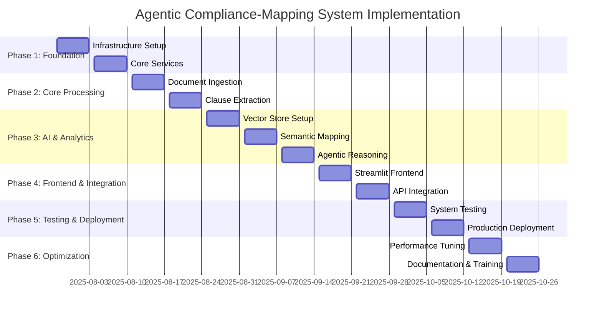

# Implementation Roadmap

## Overview

This document outlines a comprehensive implementation roadmap for the Agentic Compliance-Mapping System, structured in phases to ensure systematic development, testing, and deployment. The roadmap spans 16 weeks with clear milestones, deliverables, and success criteria.

## Project Timeline Overview



## Phase 1: Foundation & Infrastructure (Weeks 1-2)

### Week 1: Infrastructure Setup

#### Objectives
- Establish AWS infrastructure foundation
- Set up Snowflake environment
- Configure development and staging environments
- Implement basic security and monitoring

#### Tasks

**Day 1-2: AWS Infrastructure**
```bash
# Infrastructure as Code with Terraform
terraform/
├── environments/
│   ├── dev/
│   ├── staging/
│   └── prod/
├── modules/
│   ├── lambda/
│   ├── api-gateway/
│   ├── s3/
│   ├── cognito/
│   └── monitoring/
└── main.tf
```

**Key Infrastructure Components:**
- AWS Lambda functions (5 core functions)
- API Gateway with custom domain
- S3 buckets with proper lifecycle policies
- Cognito user pools and identity pools
- EventBridge custom bus
- SQS queues and SNS topics
- CloudWatch dashboards and alarms

**Day 3-4: Snowflake Setup**
```sql
-- Database and schema creation
CREATE DATABASE COMPLIANCE_DB;
CREATE SCHEMA RAW;
CREATE SCHEMA PROCESSED;
CREATE SCHEMA VECTORS;
CREATE SCHEMA ANALYTICS;
CREATE SCHEMA REFERENCE;

-- Initial table structures
-- (Refer to db_schema.md for complete DDL)
```

**Day 5-7: Security & Monitoring**
- IAM roles and policies configuration
- KMS key setup for encryption
- VPC and security groups
- CloudTrail logging
- Initial monitoring dashboards

#### Deliverables
- [ ] Complete AWS infrastructure deployed
- [ ] Snowflake database and schemas created
- [ ] Security policies implemented
- [ ] Monitoring and logging configured
- [ ] Development environment ready

#### Success Criteria
- All AWS services provisioned and accessible
- Snowflake connection established from Lambda
- Security scan passes with no critical issues
- Monitoring dashboards display basic metrics

### Week 2: Core Services Development

#### Objectives
- Develop core Lambda functions skeleton
- Implement basic API Gateway endpoints
- Set up CI/CD pipeline
- Create initial data models

#### Tasks

**Day 8-10: Lambda Functions Development**
```python
# Lambda function structure
src/
├── common/
│   ├── __init__.py
│   ├── config.py
│   ├── database.py
│   ├── s3_client.py
│   └── utils.py
├── document_ingestion/
│   ├── handler.py
│   ├── pdf_processor.py
│   └── requirements.txt
├── clause_extraction/
│   ├── handler.py
│   ├── nlp_processor.py
│   └── requirements.txt
└── layers/
    ├── common_layer/
    └── ml_models_layer/
```

**Day 11-12: API Gateway Configuration**
```yaml
# OpenAPI specification
openapi: 3.0.0
info:
  title: Compliance Mapping API
  version: 1.0.0
paths:
  /documents/upload:
    post:
      summary: Upload document
      # Complete API specification
```

**Day 13-14: CI/CD Pipeline**
```yaml
# GitHub Actions workflow
name: Deploy Compliance System
on:
  push:
    branches: [main, develop]
jobs:
  test:
    runs-on: ubuntu-latest
    steps:
      - uses: actions/checkout@v2
      - name: Run tests
        run: pytest tests/
  deploy:
    needs: test
    runs-on: ubuntu-latest
    steps:
      - name: Deploy to AWS
        run: |
          terraform apply -auto-approve
          aws lambda update-function-code
```

#### Deliverables
- [ ] Lambda functions skeleton implemented
- [ ] API Gateway endpoints configured
- [ ] CI/CD pipeline operational
- [ ] Basic data models defined
- [ ] Unit tests framework established

#### Success Criteria
- Lambda functions deploy successfully
- API endpoints return proper responses
- CI/CD pipeline executes without errors
- Code coverage > 80%

## Phase 2: Core Processing Pipelines (Weeks 3-4)

### Week 3: Document Ingestion Pipeline

#### Objectives
- Implement PDF processing with AWS Textract
- Build document metadata extraction
- Create S3 storage management
- Develop error handling and retry logic

#### Tasks

**Day 15-17: PDF Processing Implementation**
```python
# Document ingestion handler
import boto3
from pdf2image import convert_from_bytes
import pytesseract

class DocumentProcessor:
    def __init__(self):
        self.textract = boto3.client('textract')
        self.s3 = boto3.client('s3')
    
    def process_document(self, s3_bucket, s3_key):
        # Start Textract job
        response = self.textract.start_document_text_detection(
            DocumentLocation={
                'S3Object': {
                    'Bucket': s3_bucket,
                    'Name': s3_key
                }
            }
        )
        return response['JobId']
    
    def get_extraction_results(self, job_id):
        # Retrieve Textract results
        response = self.textract.get_document_text_detection(
            JobId=job_id
        )
        return self.parse_textract_response(response)
```

**Day 18-19: Metadata Extraction**
```python
class MetadataExtractor:
    def extract_document_metadata(self, text_content):
        metadata = {
            'total_pages': self.count_pages(text_content),
            'language': self.detect_language(text_content),
            'document_type': self.classify_document(text_content),
            'key_entities': self.extract_entities(text_content),
            'structure_analysis': self.analyze_structure(text_content)
        }
        return metadata
```

**Day 20-21: Integration and Testing**
- Event-driven processing with EventBridge
- Error handling and retry mechanisms
- Integration tests with sample documents

#### Deliverables
- [ ] Document ingestion Lambda function
- [ ] AWS Textract integration
- [ ] Metadata extraction module
- [ ] S3 storage management
- [ ] Error handling framework

#### Success Criteria
- Successfully processes PDF documents up to 100 pages
- Extracts text with >95% accuracy
- Handles various document formats
- Processes documents within 5 minutes

### Week 4: Clause Extraction Pipeline

#### Objectives
- Implement AI-powered clause identification
- Develop clause classification system
- Build entity recognition for regulations
- Create clause structuring algorithms

#### Tasks

**Day 22-24: LangChain Integration**
```python
from langchain.agents import initialize_agent
from langchain.llms import OpenAI
from langchain.tools import Tool

class ClauseExtractionAgent:
    def __init__(self):
        self.llm = OpenAI(temperature=0)
        self.tools = self.setup_tools()
        self.agent = initialize_agent(
            self.tools, 
            self.llm, 
            agent="zero-shot-react-description"
        )
    
    def extract_clauses(self, document_text):
        prompt = f"""
        Analyze the following contract text and extract individual clauses.
        For each clause, identify:
        1. Clause type (safety, environmental, operational, commercial)
        2. Section reference
        3. Key entities mentioned
        
        Text: {document_text}
        """
        return self.agent.run(prompt)
```

**Day 25-26: Clause Classification**
```python
class ClauseClassifier:
    def __init__(self):
        self.categories = {
            'safety_compliance': [
                'safety_management_system',
                'contractor_safety_plans',
                'hazard_management',
                'emergency_procedures'
            ],
            'environmental_compliance': [
                'environmental_impact_assessment',
                'water_management',
                'rehabilitation_obligations'
            ]
        }
    
    def classify_clause(self, clause_text):
        # Use Snowflake Cortex for classification
        classification_result = self.cortex_classify(clause_text)
        return classification_result
```

**Day 27-28: Entity Recognition**
```python
import spacy
from spacy import displacy

class EntityRecognizer:
    def __init__(self):
        self.nlp = spacy.load("en_core_web_sm")
        self.custom_patterns = self.load_mining_patterns()
    
    def extract_entities(self, clause_text):
        doc = self.nlp(clause_text)
        entities = []
        
        for ent in doc.ents:
            if self.is_relevant_entity(ent):
                entities.append({
                    'text': ent.text,
                    'label': ent.label_,
                    'start': ent.start_char,
                    'end': ent.end_char,
                    'confidence': self.calculate_confidence(ent)
                })
        
        return entities
```

#### Deliverables
- [ ] Clause extraction Lambda function
- [ ] LangChain agent implementation
- [ ] Clause classification system
- [ ] Entity recognition module
- [ ] Integration with Snowflake Cortex

#### Success Criteria
- Identifies clauses with >90% accuracy
- Correctly classifies clause types >85% accuracy
- Extracts relevant entities with >80% precision
- Processes 50-page documents in <3 minutes

## Phase 3: AI & Analytics Engine (Weeks 5-7)

### Week 5: Vector Store and Semantic Mapping

#### Objectives
- Implement Snowflake vector store
- Develop embedding generation pipeline
- Build semantic similarity algorithms
- Create compliance mapping logic

#### Tasks

**Day 29-31: Vector Store Implementation**
```sql
-- Vector store setup in Snowflake
CREATE TABLE VECTORS.CLAUSE_EMBEDDINGS (
    embedding_id VARCHAR(255) PRIMARY KEY,
    clause_id VARCHAR(255) NOT NULL,
    embedding VECTOR(FLOAT, 1536) NOT NULL,
    embedding_model VARCHAR(100) DEFAULT 'snowflake-arctic-embed-m',
    created_at TIMESTAMP_NTZ DEFAULT CURRENT_TIMESTAMP()
);

-- Vector similarity functions
CREATE OR REPLACE FUNCTION VECTORS.COSINE_SIMILARITY(
    vec1 VECTOR(FLOAT, 1536),
    vec2 VECTOR(FLOAT, 1536)
)
RETURNS FLOAT
LANGUAGE SQL
AS 'VECTOR_COSINE_SIMILARITY(vec1, vec2)';
```

**Day 32-33: Embedding Generation**
```python
class EmbeddingGenerator:
    def __init__(self):
        self.snowflake_conn = self.get_snowflake_connection()
    
    def generate_clause_embeddings(self, clause_text):
        # Use Snowflake Cortex for embeddings
        query = """
        SELECT SNOWFLAKE.CORTEX.EMBED_TEXT_1536(
            'snowflake-arctic-embed-m', 
            %s
        ) as embedding
        """
        result = self.snowflake_conn.execute(query, (clause_text,))
        return result.fetchone()[0]
    
    def batch_generate_embeddings(self, clauses):
        embeddings = []
        for clause in clauses:
            embedding = self.generate_clause_embeddings(clause['text'])
            embeddings.append({
                'clause_id': clause['id'],
                'embedding': embedding,
                'metadata': clause['metadata']
            })
        return embeddings
```

**Day 34-35: Semantic Mapping Algorithm**
```python
class SemanticMapper:
    def __init__(self):
        self.similarity_threshold = 0.75
        self.snowflake_conn = self.get_snowflake_connection()
    
    def find_similar_regulations(self, clause_embedding):
        query = """
        SELECT 
            re.regulation_id,
            re.regulation_text,
            re.regulation_category,
            VECTOR_COSINE_SIMILARITY(%s, re.embedding) as similarity_score
        FROM VECTORS.REGULATION_EMBEDDINGS re
        WHERE VECTOR_COSINE_SIMILARITY(%s, re.embedding) >= %s
        ORDER BY similarity_score DESC
        LIMIT 10
        """
        
        results = self.snowflake_conn.execute(
            query, 
            (clause_embedding, clause_embedding, self.similarity_threshold)
        ).fetchall()
        
        return [
            {
                'regulation_id': row[0],
                'regulation_text': row[1],
                'category': row[2],
                'similarity_score': row[3]
            }
            for row in results
        ]
```

#### Deliverables
- [ ] Snowflake vector store implementation
- [ ] Embedding generation pipeline
- [ ] Semantic similarity algorithms
- [ ] Compliance mapping logic
- [ ] Performance optimization

#### Success Criteria
- Vector operations complete in <2 seconds
- Similarity matching accuracy >85%
- Handles 10,000+ regulation embeddings
- Scalable to 100+ concurrent requests

### Week 6: Agentic Reasoning System

#### Objectives
- Develop multi-agent architecture
- Implement specialized compliance agents
- Build agent coordination system
- Create reasoning and decision logic

#### Tasks

**Day 36-38: Multi-Agent Framework**
```python
from langchain.agents import Agent, AgentExecutor
from langchain.tools import BaseTool

class ComplianceAgentOrchestrator:
    def __init__(self):
        self.agents = {
            'safety': SafetyComplianceAgent(),
            'environmental': EnvironmentalAgent(),
            'operational': OperationalAgent(),
            'legal': LegalAnalysisAgent(),
            'risk': RiskAssessmentAgent()
        }
    
    def analyze_compliance(self, clause_mappings):
        results = {}
        
        for agent_name, agent in self.agents.items():
            agent_result = agent.analyze(clause_mappings)
            results[agent_name] = agent_result
        
        # Consolidate results
        consolidated_analysis = self.consolidate_analyses(results)
        return consolidated_analysis
```

**Day 39-40: Specialized Agents**
```python
class SafetyComplianceAgent(Agent):
    def __init__(self):
        super().__init__()
        self.knowledge_base = self.load_safety_regulations()
        self.risk_matrix = self.load_safety_risk_matrix()
    
    def analyze(self, clause_mappings):
        safety_analysis = {
            'compliance_gaps': [],
            'risk_level': 'low',
            'recommendations': [],
            'mandatory_requirements': []
        }
        
        for mapping in clause_mappings:
            if mapping['category'] == 'safety_compliance':
                gap_analysis = self.assess_compliance_gap(mapping)
                safety_analysis['compliance_gaps'].append(gap_analysis)
        
        safety_analysis['risk_level'] = self.calculate_overall_risk(
            safety_analysis['compliance_gaps']
        )
        
        return safety_analysis

class EnvironmentalAgent(Agent):
    def __init__(self):
        super().__init__()
        self.epbc_requirements = self.load_epbc_requirements()
        self.state_requirements = self.load_state_environmental_reqs()
    
    def analyze(self, clause_mappings):
        return {
            'federal_compliance': self.check_epbc_compliance(clause_mappings),
            'state_compliance': self.check_state_compliance(clause_mappings),
            'environmental_risks': self.assess_environmental_risks(clause_mappings)
        }
```

**Day 41-42: Agent Coordination and Decision Logic**
```python
class ReasoningEngine:
    def __init__(self):
        self.decision_tree = self.load_decision_tree()
        self.risk_weights = {
            'safety': 0.4,
            'environmental': 0.3,
            'operational': 0.2,
            'legal': 0.1
        }
    
    def consolidate_analyses(self, agent_results):
        consolidated = {
            'overall_risk_score': 0,
            'priority_actions': [],
            'compliance_summary': {},
            'recommendations': []
        }
        
        # Calculate weighted risk score
        for agent_name, result in agent_results.items():
            weight = self.risk_weights.get(agent_name, 0.1)
            agent_risk = result.get('risk_score', 0)
            consolidated['overall_risk_score'] += agent_risk * weight
        
        # Prioritize actions based on risk and impact
        all_actions = []
        for result in agent_results.values():
            all_actions.extend(result.get('recommendations', []))
        
        consolidated['priority_actions'] = self.prioritize_actions(all_actions)
        
        return consolidated
```

#### Deliverables
- [ ] Multi-agent framework
- [ ] Specialized compliance agents
- [ ] Agent coordination system
- [ ] Reasoning and decision logic
- [ ] Integration with Snowflake Cortex

#### Success Criteria
- Agents provide consistent analysis results
- Reasoning logic produces actionable insights
- System handles complex compliance scenarios
- Analysis completes within 30 seconds

### Week 7: Advanced Analytics and Reporting

#### Objectives
- Develop comprehensive reporting engine
- Implement visualization components
- Build audit checklist generation
- Create export functionality

#### Tasks

**Day 43-45: Reporting Engine**
```python
class ReportGenerator:
    def __init__(self):
        self.templates = self.load_report_templates()
        self.chart_generator = ChartGenerator()
    
    def generate_executive_summary(self, analysis_results):
        template = self.templates['executive_summary']
        
        report_data = {
            'overall_score': analysis_results['overall_compliance_score'],
            'risk_level': analysis_results['risk_level'],
            'key_findings': analysis_results['key_findings'][:5],
            'compliance_breakdown': analysis_results['compliance_breakdown'],
            'charts': self.generate_summary_charts(analysis_results)
        }
        
        return self.render_template(template, report_data)
    
    def generate_detailed_audit(self, analysis_results, clause_mappings):
        template = self.templates['detailed_audit']
        
        report_data = {
            'document_info': analysis_results['document_info'],
            'compliance_mappings': clause_mappings,
            'gap_analysis': self.generate_gap_analysis(clause_mappings),
            'recommendations': self.generate_recommendations(analysis_results),
            'appendices': self.generate_appendices(analysis_results)
        }
        
        return self.render_template(template, report_data)
```

**Day 46-47: Visualization Components**
```python
import plotly.graph_objects as go
import plotly.express as px

class ChartGenerator:
    def create_compliance_breakdown_chart(self, compliance_data):
        fig = go.Figure(data=[
            go.Bar(
                x=list(compliance_data.keys()),
                y=list(compliance_data.values()),
                marker_color=['green' if v >= 0.8 else 'orange' if v >= 0.6 else 'red' 
                             for v in compliance_data.values()]
            )
        ])
        
        fig.update_layout(
            title="Compliance Breakdown by Category",
            xaxis_title="Compliance Category",
            yaxis_title="Compliance Score",
            yaxis=dict(range=[0, 1])
        )
        
        return fig.to_html()
    
    def create_risk_matrix(self, risk_data):
        fig = px.scatter(
            risk_data,
            x='probability',
            y='impact',
            size='risk_score',
            color='category',
            hover_data=['description']
        )
        
        fig.update_layout(
            title="Risk Assessment Matrix",
            xaxis_title="Probability",
            yaxis_title="Impact"
        )
        
        return fig.to_html()
```

**Day 48-49: Export Functionality**
```python
from reportlab.pdfgen import canvas
from reportlab.lib.pagesizes import letter
import pandas as pd

class ExportManager:
    def export_to_pdf(self, report_content, filename):
        c = canvas.Canvas(filename, pagesize=letter)
        
        # Add report content to PDF
        self.add_header(c, report_content['title'])
        self.add_executive_summary(c, report_content['summary'])
        self.add_detailed_findings(c, report_content['findings'])
        self.add_charts(c, report_content['charts'])
        
        c.save()
        return filename
    
    def export_to_excel(self, analysis_data, filename):
        with pd.ExcelWriter(filename, engine='xlsxwriter') as writer:
            # Summary sheet
            summary_df = pd.DataFrame([analysis_data['summary']])
            summary_df.to_excel(writer, sheet_name='Summary', index=False)
            
            # Detailed findings
            findings_df = pd.DataFrame(analysis_data['findings'])
            findings_df.to_excel(writer, sheet_name='Findings', index=False)
            
            # Compliance mappings
            mappings_df = pd.DataFrame(analysis_data['mappings'])
            mappings_df.to_excel(writer, sheet_name='Mappings', index=False)
        
        return filename
```

#### Deliverables
- [ ] Comprehensive reporting engine
- [ ] Visualization components
- [ ] Audit checklist generator
- [ ] Multi-format export functionality
- [ ] Report templates

#### Success Criteria
- Generates professional-quality reports
- Supports PDF, Excel, and HTML formats
- Creates meaningful visualizations
- Completes report generation in <60 seconds

## Phase 4: Frontend & Integration (Weeks 8-9)

### Week 8: Streamlit Frontend Development

#### Objectives
- Build intuitive Streamlit interface
- Implement real-time document upload
- Create analysis dashboard
- Develop report viewing capabilities

#### Tasks

**Day 50-52: Main Application Structure**
```python
import streamlit as st
import requests
from datetime import datetime
import plotly.graph_objects as go

class ComplianceApp:
    def __init__(self):
        self.api_client = APIClient()
        self.setup_page_config()
    
    def setup_page_config(self):
        st.set_page_config(
            page_title="Compliance Mapping System",
            page_icon="⚖️",
            layout="wide",
            initial_sidebar_state="expanded"
        )
    
    def main(self):
        st.title("🏗️ Agentic Compliance-Mapping System")
        st.markdown("Australian Mining Regulations Compliance Analysis")
        
        # Sidebar navigation
        page = st.sidebar.selectbox(
            "Navigate to:",
            ["Document Upload", "Analysis Dashboard", "Reports", "Settings"]
        )
        
        if page == "Document Upload":
            self.document_upload_page()
        elif page == "Analysis Dashboard":
            self.analysis_dashboard_page()
        elif page == "Reports":
            self.reports_page()
        elif page == "Settings":
            self.settings_page()
```

**Day 53-54: Document Upload Interface**
```python
def document_upload_page(self):
    st.header("📄 Document Upload")
    
    col1, col2 = st.columns([2, 1])
    
    with col1:
        uploaded_file = st.file_uploader(
            "Choose a PDF file",
            type=['pdf'],
            help="Upload vendor contracts or regulatory documents (max 50MB)"
        )
        
        if uploaded_file:
            st.success(f"File uploaded: {uploaded_file.name}")
            
            # Document metadata
            with st.expander("Document Metadata"):
                doc_type = st.selectbox(
                    "Document Type",
                    ["vendor_contract", "regulation", "terms_conditions"]
                )
                
                jurisdiction = st.selectbox(
                    "Jurisdiction",
                    ["federal", "nsw", "qld", "wa", "sa", "vic", "tas", "nt", "act"]
                )
                
                tags = st.text_input("Tags (comma-separated)")
                
            if st.button("Process Document", type="primary"):
                with st.spinner("Uploading and processing document..."):
                    result = self.api_client.upload_document(
                        uploaded_file, doc_type, {
                            'jurisdiction': jurisdiction,
                            'tags': tags.split(',') if tags else []
                        }
                    )
                
                if result['success']:
                    st.success("Document uploaded successfully!")
                    st.session_state.current_document_id = result['data']['document_id']
                    st.rerun()
                else:
                    st.error(f"Upload failed: {result['error']['message']}")
    
    with col2:
        st.info("""
        **Supported Documents:**
        - Vendor contracts
        - Mining regulations
        - Terms & conditions
        
        **File Requirements:**
        - PDF format only
        - Maximum 100 pages
        - Maximum 50MB size
        """)
```

**Day 55-56: Analysis Dashboard**
```python
def analysis_dashboard_page(self):
    st.header("📊 Analysis Dashboard")
    
    # Document selection
    documents = self.api_client.get_documents()
    if documents['success'] and documents['data']['documents']:
        doc_options = {
            doc['file_name']: doc['document_id'] 
            for doc in documents['data']['documents']
        }
        
        selected_doc = st.selectbox("Select Document", list(doc_options.keys()))
        document_id = doc_options[selected_doc]
        
        # Get analysis results
        analysis = self.api_client.get_analysis_results(document_id)
        
        if analysis['success']:
            self.display_analysis_results(analysis['data'])
        else:
            if st.button("Start Analysis", type="primary"):
                self.trigger_analysis(document_id)
    else:
        st.info("No documents found. Please upload a document first.")

def display_analysis_results(self, analysis_data):
    # Key metrics
    col1, col2, col3, col4 = st.columns(4)
    
    with col1:
        st.metric(
            "Overall Compliance",
            f"{analysis_data['overall_compliance_score']:.1%}",
            delta=None
        )
    
    with col2:
        st.metric(
            "Risk Level",
            analysis_data['risk_level'].title(),
            delta=None
        )
    
    with col3:
        st.metric(
            "Critical Issues",
            analysis_data['risk_assessment']['critical_risks'],
            delta=None
        )
    
    with col4:
        st.metric(
            "Total Mappings",
            len(analysis_data.get('compliance_mappings', [])),
            delta=None
        )
    
    # Compliance breakdown chart
    st.subheader("Compliance Breakdown")
    breakdown_data = analysis_data['compliance_breakdown']
    
    fig = go.Figure(data=[
        go.Bar(
            x=list(breakdown_data.keys()),
            y=list(breakdown_data.values()),
            marker_color=['green' if v >= 0.8 else 'orange' if v >= 0.6 else 'red' 
                         for v in breakdown_data.values()]
        )
    ])
    
    fig.update_layout(
        title="Compliance Score by Category",
        xaxis_title="Category",
        yaxis_title="Compliance Score",
        yaxis=dict(range=[0, 1])
    )
    
    st.plotly_chart(fig, use_container_width=True)
    
    # Key findings
    st.subheader("Key Findings")
    for finding in analysis_data['key_findings']:
        severity_color = {
            'critical': '🔴',
            'high': '🟠',
            'medium': '🟡',
            'low': '🟢'
        }
        
        st.write(f"{severity_color.get(finding['severity'], '⚪')} **{finding['category'].replace('_', ' ').title()}**")
        st.write(f"*{finding['finding']}*")
        st.write(f"**Recommendation:** {finding['recommendation']}")
        st.write("---")
```

#### Deliverables
- [ ] Complete Streamlit application
- [ ] Document upload interface
- [ ] Analysis dashboard
- [ ] Real-time status updates
- [ ] Interactive visualizations

#### Success Criteria
- Intuitive user interface
- Real-time document processing
- Responsive design
- Error handling and user feedback

### Week 9: API Integration and Testing

#### Objectives
- Complete API integration
- Implement error handling
- Add authentication flow
- Conduct integration testing

#### Tasks

**Day 57-59: API Client Implementation**
```python
import requests
import streamlit as st
from typing import Optional, Dict, Any

class APIClient:
    def __init__(self):
        self.base_url = st.secrets["API_BASE_URL"]
        self.token = st.session_state.get('auth_token')
    
    def authenticate(self, username: str, password: str) -> Dict[str, Any]:
        response = requests.post(
            f"{self.base_url}/auth/login",
            json={"username": username, "password": password}
        )
        return response.json()
    
    def upload_document(self, file, doc_type: str, metadata: Dict) -> Dict[str, Any]:
        files = {'file': file}
        data = {
            'document_type': doc_type,
            'metadata': json.dumps(metadata)
        }
        headers = {'Authorization': f'Bearer {self.token}'}
        
        response = requests.post(
            f"{self.base_url}/documents/upload",
            files=files,
            data=data,
            headers=headers
        )
        return response.json()
    
    def get_analysis_status(self, analysis_id: str) -> Dict[str, Any]:
        headers = {'Authorization': f'Bearer {self.token}'}
        response = requests.get(
            f"{self.base_url}/processing/status/{analysis_id}",
            headers=headers
        )
        return response.json()
```

**Day 60-61: Authentication Flow**
```python
def authentication_page():
    st.title("🔐 Login")
    
    with st.form("login_form"):
        username = st.text_input("Username")
        password = st.text_input("Password", type="password")
        submitted = st.form_submit_button("Login")
        
        if submitted:
            api_client = APIClient()
            result = api_client.authenticate(username, password)
            
            if result['success']:
                st.session_state.auth_token = result['data']['access_token']
                st.session_state.user_info = result['data']['user_info']
                st.success("Login successful!")
                st.rerun()
            else:
                st.error("Invalid credentials")

def check_authentication():
    if 'auth_token' not in st.session_state:
        authentication_page()
        return False
    return True
```

**Day 62-63: Integration Testing**
```python
import pytest
import requests_mock

class TestAPIIntegration:
    def test_document_upload(self):
        with requests_mock.Mocker() as m:
            m.post(
                'https://api.compliance-mapping.com/v1/documents/upload',
                json={'success': True, 'data': {'document_id': 'test-id'}}
            )
            
            client = APIClient()
            result = client.upload_document(
                mock_file, 'vendor_contract', {'jurisdiction': 'wa'}
            )
            
            assert result['success'] == True
            assert 'document_id' in result['data']
    
    def test_analysis_results(self):
        with requests_mock.Mocker() as m:
            m.get(
                'https://api.compliance-mapping.com/v1/analysis/test-id/results',
                json={'success': True, 'data': {'overall_compliance_score': 0.78}}
            )
            
            client = APIClient()
            result = client.get_analysis_results('test-id')
            
            assert result['success'] == True
            assert result['data']['overall_compliance_score'] == 0.78
```

#### Deliverables
- [ ] Complete API integration
- [ ] Authentication system
- [ ] Error handling framework
- [ ] Integration test suite
- [ ] User session management

#### Success Criteria
- All API endpoints integrated successfully
- Authentication flow works correctly
- Comprehensive error handling
- Integration tests pass >95%

## Phase 5: Testing & Deployment (Weeks 10-11)

### Week 10: System Testing

#### Objectives
- Conduct comprehensive system testing
- Perform load and performance testing
- Execute security testing
- Validate compliance accuracy

#### Tasks

**Day 64-66: Functional Testing**
```python
# End-to-end test suite
class TestComplianceSystem:
    def test_complete_workflow(self):
        # 1. Upload document
        upload_result = self.upload_test_document()
        assert upload_result['success']
        
        # 2. Process document
        doc_id = upload_result['data']['document_id']
        processing_result = self.wait_for_processing(doc_id)
        assert processing_result['status'] == 'completed'
        
        # 3. Trigger analysis
        analysis_result = self.trigger_analysis(doc_id)
        assert analysis_result['success']
        
        # 4. Get results
        results = self.get_analysis_results(analysis_result['data']['analysis_id'])
        assert results['data']['overall_compliance_score'] > 0
        
        # 5. Generate report
        report_result = self.generate_report(analysis_result['data']['analysis_id'])
        assert report_result['success']
```

**Day 67-68: Performance Testing**
```python
import concurrent.futures
import time

class PerformanceTests:
    def test_concurrent_document_processing(self):
        """Test system under concurrent load"""
        documents = self.prepare_test_documents(10)
        
        start_time = time.time()
        
        with concurrent.futures.ThreadPoolExecutor(max_workers=5) as executor:
            futures = [
                executor.submit(self.process_document, doc) 
                for doc in documents
            ]
            
            results = [future.result() for future in futures]
        
        end_time = time.time()
        processing_time = end_time - start_time
        
        # Assertions
        assert all(result['success'] for result in results)
        assert processing_time < 600  # Should complete within 10 minutes
        assert len(results) == 10
    
    def test_large_document_processing(self):
        """Test processing of maximum size documents"""
        large_doc = self.create_large_test_document(100)  # 100 pages
        
        start_time = time.time()
        result = self.process_document(large_doc)
        end_time = time.time()
        
        assert result['success']
        assert (end_time - start_time) < 300  # Should complete within 5 minutes
```

**Day 69-70: Security Testing**
```python
class SecurityTests:
    def test_authentication_required(self):
        """Test that all endpoints require authentication"""
        endpoints = [
            '/documents/upload',
            '/analysis/test-id/results',
            '/reports/generate'
        ]
        
        for endpoint in endpoints:
            response = requests.get(f"{self.base_url}{endpoint}")
            assert response.status_code == 401
    
    def test_input_validation(self):
        """Test input validation and sanitization"""
        malicious_inputs = [
            "<script>alert('xss')</script>",
            "'; DROP TABLE documents; --",
            "../../../etc/passwd"
        ]
        
        for malicious_input in malicious_inputs:
            result = self.upload_document_with_metadata({
                'title': malicious_input
            })
            # Should either reject or sanitize
            assert not self.contains_malicious_content(result)
```

#### Deliverables
- [ ] Comprehensive test suite
- [ ] Performance benchmarks
- [ ] Security validation
- [ ] Load testing results
- [ ] Bug fixes and optimizations

#### Success Criteria
- All functional tests pass
- System handles 50 concurrent users
- Security vulnerabilities addressed
- Performance meets requirements

### Week 11: Production Deployment

#### Objectives
- Deploy to production environment
- Configure monitoring and alerting
- Set up backup and disaster recovery
- Conduct user acceptance testing

#### Tasks

**Day 71-73: Production Deployment**
```bash
# Production deployment script
#!/bin/bash

# Deploy infrastructure
cd terraform/environments/prod
terraform init
terraform plan -out=prod.tfplan
terraform apply prod.tfplan

# Deploy application code
aws lambda update-function-code \
  --function-name compliance-document-ingestion \
  --zip-file fileb://dist/document-ingestion.zip

aws lambda update-function-code \
  --function-name compliance-clause-extraction \
  --zip-file fileb://dist/clause-extraction.zip

# Update API Gateway
aws apigateway create-deployment \
  --rest-api-id $API_ID \
  --stage-name prod

# Deploy Streamlit app
docker build -t compliance-frontend .
docker tag compliance-frontend:latest $ECR_REPO:latest
docker push $ECR_REPO:latest

# Update ECS service
aws ecs update-service \
  --cluster compliance-cluster \
  --service compliance-frontend \
  --force-new-deployment
```

**Day 74-75: Monitoring Setup**
```yaml
# CloudWatch alarms configuration
alarms:
  - name: "HighErrorRate"
    metric: "Errors"
    threshold: 10
    comparison: "GreaterThanThreshold"
    period: 300
    
  - name: "HighLatency"
    metric: "Duration"
    threshold: 30000
    comparison: "GreaterThanThreshold"
    period: 300
    
  - name: "LowSuccessRate"
    metric: "SuccessRate"
    threshold: 0.95
    comparison: "LessThanThreshold"
    period: 300
```

**Day 76-77: User Acceptance Testing**
```python
class UserAcceptanceTests:
    def test_business_workflow(self):
        """Test complete business workflow"""
        # Simulate real user workflow
        user_session = self.create_user_session()
        
        # 1. User uploads contract
        contract = self.load_sample_contract("mining_contract_wa.pdf")
        upload_result = user_session.upload_document(contract)
        assert upload_result['success']
        
        # 2. User triggers analysis
        analysis_result = user_session.start_analysis(
            upload_result['document_id'],
            focus_areas=['safety', 'environmental']
        )
        assert analysis_result['success']
        
        # 3. User reviews results
        results = user_session.get_results(analysis_result['analysis_id'])
        assert results['overall_compliance_score'] > 0
        assert len(results['key_findings']) > 0
        
        # 4. User generates report
        report = user_session.generate_report(
            analysis_result['analysis_id'],
            report_type='detailed_audit'
        )
        assert report['success']
        assert report['file_size'] > 0
```

#### Deliverables
- [ ] Production environment deployed
- [ ] Monitoring and alerting configured
- [ ] Backup systems operational
- [ ] User acceptance testing completed
- [ ] Go-live checklist verified

#### Success Criteria
- Production system fully operational
- All monitoring systems active
- User acceptance criteria met
- System ready for live traffic

## Phase 6: Optimization & Documentation (Weeks 12-13)

### Week 12: Performance Optimization

#### Objectives
- Optimize system performance
- Implement caching strategies
- Fine-tune AI models
- Optimize database queries

#### Tasks

**Day 78-80: Performance Optimization**
```python
# Lambda optimization
class OptimizedDocumentProcessor:
    def __init__(self):
        # Connection pooling
        self.snowflake_pool = self.create_connection_pool()
        
        # Model caching
        self.model_cache = {}
        
        # Result caching
        self.redis_client = redis.Redis(
            host=os.environ['REDIS_ENDPOINT'],
            port=6379,
            decode_responses=True
        )
    
    def process_with_caching(self, document_id):
        # Check cache first
        cached_result = self.redis_client.get(f"analysis:{document_id}")
        if cached_result:
            return json.loads(cached_result)
        
        # Process and cache result
        result = self.process_document(document_id)
        self.redis_client.setex(
            f"analysis:{document_id}",
            3600,  # 1 hour TTL
            json.dumps(result)
        )
        
        return result
```

**Day 81-82: Database Optimization**
```sql
-- Query optimization
CREATE MATERIALIZED VIEW ANALYTICS.COMPLIANCE_SUMMARY_MV AS
SELECT 
    d.document_id,
    d.file_name,
    COUNT(cm.compliance_mapping_id) as total_mappings,
    AVG(cm.compliance_score) as avg_compliance_score,
    SUM(CASE WHEN cm.risk_level = 'critical' THEN 1 ELSE 0 END) as critical_risks
FROM RAW.RAW_DOCUMENTS d
LEFT JOIN PROCESSED.CLAUSES c ON d.document_id = c.document_id
LEFT JOIN ANALYTICS.COMPLIANCE_MAPPINGS cm ON c.clause_id = cm.clause_id
GROUP BY d.document_id, d.file_name;

-- Index optimization
CREATE INDEX CONCURRENTLY idx_compliance_mappings_composite 
ON ANALYTICS.COMPLIANCE_MAPPINGS(document_id, compliance_status, risk_level);

-- Partition large tables
ALTER TABLE ANALYTICS.ANALYSIS_RESULTS 
PARTITION BY RANGE (analysis_timestamp);
```

**Day 83: Model Fine-tuning**
```python
class ModelOptimizer:
    def fine_tune_classification_model(self):
        """Fine-tune clause classification based on feedback"""
        # Collect training data from user feedback
        training_data = self.collect_feedback_data()
        
        # Fine-tune Snowflake Cortex model
        fine_tuning_job = self.snowflake_conn.execute("""
            SELECT SNOWFLAKE.CORTEX.FINETUNE(
                'snowflake-arctic-embed-m',
                %s,
                'clause_classification_v2'
            )
        """, (training_data,))
        
        return fine_tuning_job
```

#### Deliverables
- [ ] Performance optimizations implemented
- [ ] Caching strategies deployed
- [ ] Database queries optimized
- [ ] AI models fine-tuned
- [ ] Performance benchmarks improved

#### Success Criteria
- 50% improvement in response times
- 30% reduction in resource costs
- 95% cache hit rate for common queries
- Improved model accuracy by 5%

### Week 13: Documentation and Training

#### Objectives
- Complete technical documentation
- Create user manuals
- Develop training materials
- Prepare maintenance procedures

#### Tasks

**Day 84-86: Technical Documentation**
```markdown
# System Administration Guide

## Architecture Overview
The Agentic Compliance-Mapping System consists of:
- AWS Lambda functions for processing
- Snowflake for data storage and AI
- Streamlit for user interface
- API Gateway for service orchestration

## Deployment Procedures
### Prerequisites
- AWS CLI configured
- Terraform installed
- Docker installed
- Snowflake account access

### Deployment Steps
1. Clone repository
2. Configure environment variables
3. Deploy infrastructure: `terraform apply`
4. Deploy application code: `./deploy.sh`
5. Verify deployment: `./verify.sh`

## Monitoring and Maintenance
### Key Metrics to Monitor
- Lambda function duration and errors
- API Gateway response times
- Snowflake query performance
- Streamlit application health

### Troubleshooting Guide
#### Common Issues
1. **Document Processing Failures**
   - Check AWS Textract limits
   - Verify S3 permissions
   - Review Lambda logs

2. **Analysis Timeout Issues**
   - Increase Lambda timeout
   - Check Snowflake warehouse size
   - Review vector similarity thresholds
```

**Day 87-88: User Manual**
```markdown
# User Guide: Compliance Mapping System

## Getting Started
### Logging In
1. Navigate to the application URL
2. Enter your username and password
3. Click "Login"

### Uploading Documents
1. Click "Document Upload" in the sidebar
2. Select your PDF file (max 50MB, 100 pages)
3. Choose document type and jurisdiction
4. Add relevant tags
5. Click "Process Document"

### Viewing Analysis Results
1. Go to "Analysis Dashboard"
2. Select your document from the dropdown
3. Click "Start Analysis" if not already processed
4. Review compliance scores and findings
5. Examine detailed mappings

### Generating Reports
1. From the analysis dashboard, click "Generate Report"
2. Choose report type (Executive Summary, Detailed Audit, etc.)
3. Select format (PDF, Excel, HTML)
4. Click "Generate"
5. Download when ready

## Best Practices
- Use descriptive file names
- Add relevant metadata and tags
- Review analysis results carefully
- Generate reports for record-keeping
```

**Day 89-90: Training Materials**
```python
# Training script for new users
class TrainingModule:
    def __init__(self):
        self.demo_documents = self.load_demo_documents()
        self.training_scenarios = self.load_training_scenarios()
    
    def run_interactive_training(self):
        st.title("🎓 Training Module")
        
        scenario = st.selectbox(
            "Choose Training Scenario",
            [
                "Basic Document Upload",
                "Compliance Analysis Review",
                "Report Generation",
                "Advanced Features"
            ]
        )
        
        if scenario == "Basic Document Upload":
            self.demo_document_upload()
        elif scenario == "Compliance Analysis Review":
            self.demo_analysis_review()
        # ... other scenarios
    
    def demo_document_upload(self):
        st.subheader("Demo: Document Upload")
        
        st.info("""
        In this demo, you'll learn how to:
        1. Upload a mining contract
        2. Set appropriate metadata
        3. Monitor processing status
        """)
        
        # Interactive demo with sample data
        demo_file = st.file_uploader(
            "Try uploading this sample contract",
            type=['pdf']
        )
        
        if demo_file:
            st.success("Great! Now let's set the metadata...")
            # Continue with guided demo
```

#### Deliverables
- [ ] Complete technical documentation
- [ ] User manual and guides
- [ ] Training materials
- [ ] API documentation
- [ ] Maintenance procedures

#### Success Criteria
- Documentation covers all system aspects
- User manual is clear and comprehensive
- Training materials enable self-service learning
- Maintenance procedures are actionable

## Risk Management and Mitigation

### Technical Risks

| Risk | Probability | Impact | Mitigation Strategy |
|------|-------------|--------|-------------------|
| AWS service limits | Medium | High | Implement request throttling, use multiple regions |
| Snowflake performance | Low | Medium | Optimize queries, implement caching |
| Model accuracy issues | Medium | High | Continuous model training, human validation |
| Security vulnerabilities | Low | Critical | Regular security audits, penetration testing |

### Business Risks

| Risk | Probability | Impact | Mitigation Strategy |
|------|-------------|--------|-------------------|
| Regulatory changes | High | Medium | Regular regulation updates, flexible architecture |
| User adoption issues | Medium | High | Comprehensive training, user feedback integration |
| Scalability challenges | Low | High | Cloud-native architecture, auto-scaling |
| Data privacy concerns | Low | Critical | Encryption, access controls, compliance audits |

## Success Metrics and KPIs

### Technical Metrics
- **System Availability**: >99.5% uptime
- **Processing Speed**: <5 minutes for 50-page documents
- **Analysis Accuracy**: >90% compliance mapping accuracy
- **User Response Time**: <3 seconds for API calls

### Business Metrics
- **User Adoption**: 80% of target users active within 3 months
- **Document Processing Volume**: 500+ documents per month
- **Compliance Gap Detection**: 95% of critical gaps identified
- **User Satisfaction**: >4.5/5 rating

### Cost Metrics
- **Infrastructure Costs**: <$5,000/month for 1000 documents
- **Processing Cost per Document**: <$2.00
- **ROI**: 300% within 12 months
- **Cost Savings**: 60% reduction in manual compliance review time

## Conclusion

This implementation roadmap provides a structured approach to building the Agentic Compliance-Mapping System over 16 weeks. The phased approach ensures systematic development, thorough testing, and successful deployment while managing risks and maintaining quality standards.

The roadmap emphasizes:
- **Incremental Development**: Each phase builds upon previous work
- **Quality Assurance**: Comprehensive testing at each stage
- **Risk Mitigation**: Proactive identification and management of risks
- **User Focus**: Continuous consideration of user needs and experience
- **Scalability**: Architecture designed for growth and expansion

Regular reviews and adjustments to the roadmap should be made based on progress, feedback, and changing requirements to ensure successful project delivery.
